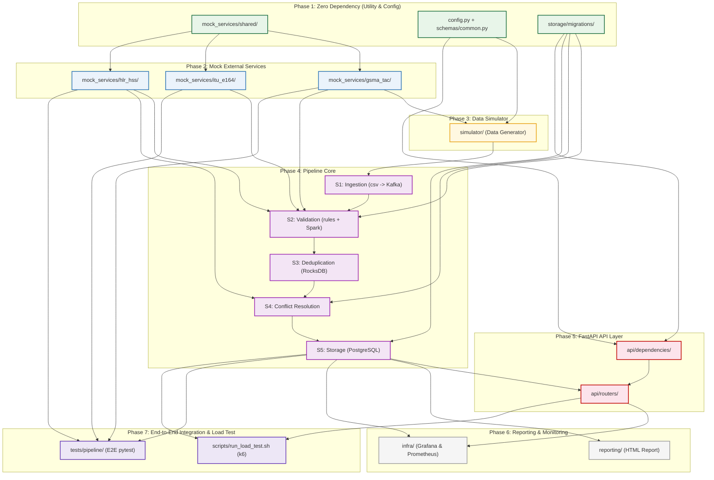

# Thứ tá»± Code & Bản đồ Phụ thuá»™c (Build Order & Dependency Map)
## CAMARA Network API Data Pipeline — 7 Phase · 20 Modules

> **TÀI LIỆU LỖI THỜI — Phase 4 đã thay đổi hoàn toàn**
>
> Kiến trúc Spark Streaming 5-stage (S1 Ingestion → S2 Validation → S3 Deduplication
> → S4 Conflict → S5 Storage) và toàn bộ Phase 2 (mock services) đã bị loại bỏ.
> Pipeline hiện tại dùng **3 Kafka consumer modules** chạy song song:
> cg-ip-msisdn, cg-device-swap, cg-sim-swap.
>
> - Kiến trúc mới: xem README.md section 0
> - Lý do bỏ Spark: xem docs/adr/0001-drop-spark-use-kafka-consumer.md
> - Tài liệu này được giữ lại để tham khảo lịch sử — Phase 1, 5, 6, 7 vẫn có giá trị,
>   chỉ Phase 2 và 4 không còn đúng.

TĂ i liệu nĂ y hÆ°á»›ng dẫn chi tiết thứ tá»± phĂ¡t triển (build order) vĂ  sÆ¡ đồ phụ thuá»™c giữa cĂ¡c module trong hệ thống **CAMARA Network API Data Pipeline**. CĂ¡c module được thiết kế vĂ  sắp xếp theo lá»™ trình tối Æ°u hĂ³a khả năng test Ä‘á»™c lập, giảm thiểu phụ thuá»™c chĂ©o vĂ  há»— trợ phĂ¡t triển song song hiệu quả.

---

## đŸ—ºï¸ SÆ¡ đồ phụ thuá»™c tổng quan (Dependency Graph)

---

## ⚡ Khả năng lĂ m song song (Parallel Tracks)

> [!TIP]
> Để tăng tốc Ä‘á»™ phĂ¡t triển dá»± Ă¡n, cĂ¡c phần sau cĂ³ thể triển khai song song:
> - **CĂ¡c module trong Phase 1** chạy song song Ä‘á»™c lập hoĂ n toĂ n.
> - **CĂ¡c mock services ở Phase 2** phĂ¡t triển song song sau khi hoĂ n thĂ nh `mock_services/shared/` của Phase 1.
> - **Storage models** (`pipeline/storage/models.py`) cĂ³ thể viết song song vá»›i **SQL migrations** (`storage/migrations/`).
> - **FastAPI Schema & Dependency** (`api/schemas/` vĂ  `api/dependencies/`) cĂ³ thể viết song song trong khi Ä‘ang code Phase 4.
> - **Hạ tầng giĂ¡m sĂ¡t** (`infra/` Grafana, Prometheus) cĂ³ thể cấu hình song song khi lĂ m Phase 5.

---

## đŸ“‹ Chi tiết từng giai Ä‘oạn (Phase Details)

### Phase 1: Zero Dependency — Code & Test hoĂ n toĂ n Ä‘á»™c lập
*Giai Ä‘oạn nền tảng, chứa cĂ¡c utility thuần tĂºy vĂ  cấu hình, khĂ´ng phụ thuá»™c vĂ o database hay network.*

| Module | Đường dẫn / TĂªn file | LĂ½ do cĂ³ thể code trÆ°á»›c | CĂ¡ch test | Output cho module sau |
|---|---|---|---|---|
| **shared** | `mock_services/shared/` ↳ `health.py`, `pagination.py`, `errors.py` | Tiện Ă­ch dĂ¹ng chung thuần (pure utility) — khĂ´ng import gì từ project. | `pytest unit`: test error format, test Page[T] generic, test fault-injection header parse. | Shared library sá»­ dụng bởi 3 mock services ở Phase 2. |
| **config_models** | `simulator/config.py` + `api/schemas/common.py` ↳ `SimulatorConfig`, `PhoneNumber`, `ErrorResponse` | Cấu hình dạng Dataclass vĂ  Pydantic model thuần — zero external dependencies. | `pytest unit`: validate PhoneNumber chuẩn E.164, validate SimulatorConfig bounds. | Type contracts dĂ¹ng xuyĂªn suốt project. |
| **storage_migrations** | `storage/migrations/` ↳ `001_init_schema.sql`, `002_indexes.sql`, `003_partitions.sql` | SQL DDL thuần — viết vĂ  review offline, khĂ´ng cần service nĂ o chạy. | Chạy trĂªn PostgreSQL Docker Ä‘Æ¡n lẻ, kiểm tra `EXPLAIN ANALYZE` cho 3 query pattern chĂ­nh. | Database Schema Ä‘Ă£ kiểm chứng — tất cả module sau đều build trĂªn schema nĂ y. |

---

### Phase 2: Mock Services — Độc lập với pipeline, test với dữ liệu tĩnh
*MĂ´ phỏng cĂ¡c API bĂªn ngoĂ i của bĂªn thứ ba, chạy Ä‘á»™c lập vĂ  khĂ´ng phụ thuá»™c vĂ o Kafka/Spark.*

| Module | Đường dẫn / TĂªn file | Phụ thuá»™c | LĂ½ do cĂ³ thể code | CĂ¡ch test | Output cho module sau |
|---|---|---|---|---|---|
| **gsma_tac** | `mock_services/gsma_tac/` ↳ `models.py`, `seed.py`, `router.py`, `app.py` | `shared` | Chỉ cần shared utility + file CSV tÄ©nh. KhĂ´ng cần database hay Kafka. | `pytest`: GET `/tac/{tac}` found/not-found, POST `/batch`, pagination, fault-injection. | HTTP API `:8100` — DĂ¹ng bởi simulator (Phase 3) vĂ  pipeline/validation (Phase 4). |
| **itu_e164** | `mock_services/itu_e164/` ↳ `models.py`, `seed.py`, `router.py`, `app.py` | `shared` | Chỉ cần shared + 2 CSV tÄ©nh (country codes, operator prefixes). KhĂ´ng lÆ°u state. | `pytest`: POST `/validate` (valid/invalid/unknown CC, short number), POST `/validate/batch`. | HTTP API `:8300` — DĂ¹ng cho quy trình kiểm tra validation Rule R2 ở Phase 4. |
| **hlr_hss** | `mock_services/hlr_hss/` ↳ `models.py`, `seed.py`, `router.py`, `app.py` | `shared` | Chỉ cần shared + `subscribers.csv`. Cần dĂ¹ng `seed=42` để khá»›p bá»™ sinh dữ liệu. | `pytest`: by-imsi/by-msisdn found/404, imsi-history length, batch-lookup mixed. | HTTP API `:8200` — DĂ¹ng cho Rule R3 vĂ  luồng conflict_resolution (Phase 4+). |

> [!WARNING]
> Kịch bản seed dữ liệu (`seed.py` của HLR/HSS) phải được chạy TRƯỚC KHI khởi Ä‘á»™ng bá»™ sinh dữ liệu của simulator để đảm bảo chĂºng cĂ³ chung tệp thuĂª bao (subscriber pool).

---

### Phase 3: Simulator — Bộ giả lập sinh log
*Tạo lập log thĂ´ mĂ´ phỏng cĂ¡c sá»± kiện mạng GGSN RADIUS.*

| Module | Đường dẫn / TĂªn file | Phụ thuá»™c | LĂ½ do cĂ³ thể code | CĂ¡ch test | Output cho module sau |
|---|---|---|---|---|---|
| **simulator** | `simulator/` ↳ `generators.py`, `error_injectors.py`, `simulator.py` | `gsma_tac`, `config_models` | Cần gọi GET `/tac` của GSMA TAC Mock để tải danh sĂ¡ch mĂ£ TAC hợp lệ lĂºc khởi Ä‘á»™ng. | **Integration test**: Chạy vá»›i `--records 10000 --seed 42`, kiểm tra file CSV đầu ra cĂ³ Ä‘Ăºng schema, tá»· lệ lá»—i nằm trong khoảng ±1% so vá»›i config, mọi IMEI hợp lệ đều cĂ³ TAC trong mock. | `data/radius_log.csv` — File log thĂ´ lĂ m dữ liệu đầu vĂ o cho pipeline xá»­ lĂ½. |

> [!NOTE]
> Module `error_injectors.py` cĂ³ thể được code Ä‘á»™c lập trÆ°á»›c `generators.py` vì nĂ³ chỉ biến đổi bản ghi (record) Ä‘Ă£ được tạo sẵn để nhồi lá»—i.

---

### Phase 4: Pipeline Core — Luồng xá»­ lĂ½ dữ liệu Spark Streaming
*XĂ¢y dá»±ng vĂ  kiểm thá»­ tuần tá»± từng stage của luồng xá»­ lĂ½ chĂ­nh.*

| Module | Đường dẫn / TĂªn file | Phụ thuá»™c | LĂ½ do cĂ³ thể code | CĂ¡ch test | Output cho module sau |
|---|---|---|---|---|---|
| **s1_ingestion** | `pipeline/ingestion/` ↳ `csv_reader.py`, `producer.py` | `simulator` | Chỉ cần Kafka Ä‘ang chạy + file CSV từ simulator. KhĂ´ng cần DB hay mock API. | **Integration**: Đẩy 1,000 records → consume từ topic `radius.raw` → kiểm tra số lượng vĂ  phĂ¢n vĂ¹ng (partition key). | Topic Kafka `radius.raw` được đẩy dữ liệu thĂ´ liĂªn tục. |
| **s2_validation** | `pipeline/validation/` ↳ `rules.py`, `validator.py` | `s1_ingestion`, `gsma_tac`, `hlr_hss`, `itu_e164`, `storage_migrations` | Chứa logic kiểm thá»­ cĂ¡c luật nghiệp vụ (Rules). `rules.py` gọi 3 mock services, `validator.py` cần Kafka + Spark. | **Unit test `rules.py`**: Mock HTTP client bằng `httpx.MockTransport` để kiểm tra cĂ¡c rule Ä‘á»™c lập mĂ  khĂ´ng cần chạy mock API thật. **Integration test `validator.py`**: Cần chạy Kafka + 3 mock APIs. | Dữ liệu chia luồng vĂ  lÆ°u vĂ o database: `radius.valid`, `radius.invalid`, `invalid_log`. |
| **s3_dedup** | `pipeline/deduplication/` ↳ `state_manager.py`, `dedup_job.py` | `s2_validation` | Chỉ xá»­ lĂ½ lọc trĂ¹ng từ topic `radius.valid` qua Spark RocksDB State Store. KhĂ´ng gọi API ngoĂ i. | **Integration**: Nhồi dữ liệu trĂ¹ng hoĂ n toĂ n vĂ  trĂ¹ng mấp mĂ© (near-duplicate) vĂ o `radius.valid` → kiểm tra chỉ 1 record Ä‘i tiếp vĂ o `radius.dedup`, bảng `duplicate_log` ghi Ä‘Ăºng số lượng. | Topic Kafka `radius.dedup` sạch dữ liệu trĂ¹ng lặp. |
| **s4_conflict** | `pipeline/conflict_resolution/` ↳ `resolver.py`, `swap_detector.py` | `s3_dedup`, `hlr_hss`, `storage_migrations` | XĂ¡c định cĂ¡c xung Ä‘á»™t SIM/Device. `swap_detector.py` cần gọi HLR/HSS mock lấy lịch sá»­ IMSI. | **Unit test `resolver.py`**: Tạo dữ liệu giả lập conflict A/B/C → xĂ¡c nhận kết quả định tuyến. **Integration**: Chạy kèm HLR/HSS mock + Kafka + Postgres. | Topic Kafka `radius.clean` + Bảng ghi nhận hoĂ¡n đổi thiết bị `swap_event` + `conflict_log`. |
| **s5_storage** | `pipeline/storage/` ↳ `models.py`, `writer.py` | `s4_conflict`, `storage_migrations` | Ghi dữ liệu sạch cuối cĂ¹ng vĂ o cÆ¡ sở dữ liệu PostgreSQL Ä‘Ă£ được chạy migration. | **Integration**: Consume từ `radius.clean` → kiểm tra bảng `radius_sessions`, phĂ¢n vĂ¹ng thĂ¡ng chuẩn, check cĂ¢u lệnh query cĂ³ tối Æ°u. | Bảng dữ liệu `radius_sessions` sẵn sĂ ng để API truy vấn. |

---

### Phase 5: API Layer — FastAPI phục vụ CAMARA API
*Tầng phục vụ ứng dụng, cung cấp cĂ¡c endpoint SIM Swap, Device Swap vĂ  Number Verification.*

| Module | Đường dẫn / TĂªn file | Phụ thuá»™c | LĂ½ do cĂ³ thể code | CĂ¡ch test | Output cho module sau |
|---|---|---|---|---|---|
| **api_deps** | `api/dependencies/` & `api/schemas/` ↳ `auth.py`, `database.py`, `sim_swap.py`,... | `storage_migrations`, `config_models` | Thiết lập xĂ¡c thá»±c API key (auth) vĂ  pool kết nối database (`asyncpg`), định nghÄ©a Pydantic schemas. | **Unit test**: Kiểm tra tĂ­nh hợp lệ của API Key, cĂ¡c định dạng đầu vĂ o (phoneNumber E.164, maxAge range). | Dependencies vĂ  schemas sẵn sĂ ng nhĂºng vĂ o routers. |
| **api_routers** | `api/routers/` + `api/main.py` ↳ `sim_swap.py`, `device_swap.py`, `health.py`,... | `s5_storage`, `api_deps` | CĂ¡c router truy vấn dữ liệu trá»±c tiếp từ PostgreSQL (bảng `radius_sessions` & `swap_event`). | **Integration test**: Tạo trÆ°á»›c dữ liệu mẫu (mock data) trong Postgres test DB để chạy test suite Ä‘á»™c lập mĂ  khĂ´ng cần chờ pipeline chạy thá»±c tế. | 3 endpoints CAMARA hoạt Ä‘á»™ng tại cổng `:8000`. |

---

### Phase 6: Reporting & Observability — BĂ¡o cĂ¡o & GiĂ¡m sĂ¡t vận hĂ nh
*CĂ¡c cĂ´ng cụ há»— trợ bĂ¡o cĂ¡o chất lượng dữ liệu vĂ  giĂ¡m sĂ¡t hệ thống thời gian thá»±c.*

| Module | Đường dẫn / TĂªn file | Phụ thuá»™c | MĂ´ tả hoạt Ä‘á»™ng | CĂ¡ch test | Output / Kết quả |
|---|---|---|---|---|---|
| **reporting** | `reporting/` ↳ `metrics_collector.py`, `quality_report.py`, Jinja2 template | `s5_storage` | Tổng hợp số liệu từ cĂ¡c bảng log (`invalid_log`, `duplicate_log`, `conflict_log`) để xuất bĂ¡o cĂ¡o. | Tạo dữ liệu log giả lập trong Postgres → Chạy `quality_report.py` → Kiểm tra file bĂ¡o cĂ¡o HTML. | BĂ¡o cĂ¡o HTML Data Quality Report hoĂ n chỉnh. |
| **infra_monitoring** | `infra/` (Prometheus & Grafana) ↳ `prometheus.yml`, `pipeline_dashboard.json` | `api_routers`, `s5_storage` | Thu thập metrics hiệu năng từ FastAPI, Spark vĂ  PostgreSQL. | Kiểm tra trạng thĂ¡i Prometheus targets, verify giao diện Grafana hiển thị đầy đủ biểu đồ. | Dashboard hiển thị lượng throughput/latency trá»±c tiếp. |

---

### Phase 7: End-to-End Integration & Load Test
*ÄĂ¡nh giĂ¡ toĂ n diện hệ thống dÆ°á»›i tải trọng cao vĂ  kiểm thá»­ tĂ­ch hợp đầu cuối.*

| Module | Đường dẫn / TĂªn file | Phụ thuá»™c | MĂ´ tả kịch bản | Kết quả mong đợi |
|---|---|---|---|---|
| **e2e_tests** | `tests/pipeline/` (TC23–TC33) ↳ `test_deduplication.py`, `test_validation.py`,... | `s5_storage`, `gsma_tac`, `hlr_hss`, `itu_e164` | Chạy toĂ n bá»™ stack hệ thống, đẩy bản ghi vĂ o Kafka raw, đợi Spark xá»­ lĂ½ vĂ  assert dữ liệu cuối trong Postgres. | Kiểm chứng tĂ­nh chĂ­nh xĂ¡c của toĂ n bá»™ luồng pipeline. |
| **load_test** | `scripts/run_load_test.sh` ↳ Kịch bản k6 cho 3 endpoints | `api_routers`, `s5_storage` | Chạy thá»­ nghiệm vá»›i 100 Virtual Users (VU) trong vĂ²ng 60s, kiểm tra hiệu năng khi PostgreSQL Ä‘Ă£ được nạp sẵn ~2M dĂ²ng dữ liệu. | Đảm bảo SLA: p95 SIM/Device Swap ≤ 200ms, Number Verification ≤ 100ms. |

---

## đŸ“Š TĂ³m tắt khả năng Test Ä‘á»™c lập (Mock / Dependency Table)

Bảng dÆ°á»›i Ä‘Ă¢y thống kĂª mức Ä‘á»™ Ä‘á»™c lập khi kiểm thá»­ của từng module, giĂºp cĂ¡c kỹ sÆ° phĂ¡t triển cĂ³ thể xĂ¡c định cần chuẩn bị những thĂ nh phần hạ tầng (infrastructure) nĂ o khi phĂ¡t triển module Ä‘Ă³:

| Module | Mức Ä‘á»™ kiểm thá»­ Ä‘á»™c lập | ThĂ nh phần hạ tầng cần thiết |
|---|---|---|
| **mock_services/shared/** | ✔ HoĂ n toĂ n Ä‘á»™c lập | KhĂ´ng cần |
| **simulator/config.py + api/schemas/common.py** | ✔ HoĂ n toĂ n Ä‘á»™c lập | KhĂ´ng cần |
| **storage/migrations/** | ✔ Gần như độc lập | Chỉ cần PostgreSQL (Docker đơn lẻ) |
| **mock_services/gsma_tac/** | ✔ Độc lập | KhĂ´ng cần (dĂ¹ng dữ liệu CSV) |
| **mock_services/itu_e164/** | ✔ Độc lập | KhĂ´ng cần (dĂ¹ng dữ liệu CSV) |
| **mock_services/hlr_hss/** | ✔ Độc lập | KhĂ´ng cần (dĂ¹ng dữ liệu CSV) |
| **simulator/** | ⚠ Phụ thuá»™c Mock API | Cần chạy **GSMA TAC mock** (`:8100`) |
| **pipeline/ingestion/** | ⚠ Phụ thuá»™c Kafka | Cần chạy **Kafka broker** vĂ  file CSV giả lập |
| **pipeline/validation/ rules.py** | ✔ Unit test Ä‘á»™c lập được | Sá»­ dụng `httpx.MockTransport` (khĂ´ng cần Mock API thá»±c) |
| **pipeline/validation/ (tĂ­ch hợp)** | ⚠ Cần tĂ­ch hợp | Cần Kafka + 3 Mock APIs + PostgreSQL |
| **pipeline/deduplication/** | ⚠ Cần Spark + Kafka | Cần Kafka + Spark Engine + PostgreSQL |
| **pipeline/conflict_resolution/** | ⚠ Cần tĂ­ch hợp | Cần Kafka + Spark + HLR/HSS mock + PostgreSQL |
| **pipeline/storage/** | ⚠ Cần Storage | Cần Kafka + Spark + PostgreSQL |
| **api/ (unit test: auth & schemas)** | ✔ HoĂ n toĂ n Ä‘á»™c lập | KhĂ´ng cần |
| **api/ (integration test)** | ⚠ Cần Database | Chỉ cần PostgreSQL Ä‘Ă£ được nạp dữ liệu mẫu |
| **reporting/** | ⚠ Cần Database | Chỉ cần PostgreSQL chứa dữ liệu log |
| **tests/pipeline/ (E2E)** | ✗ KhĂ´ng Ä‘á»™c lập | Phải chạy **toĂ n bá»™ stack hệ thống** |
| **load test (k6)** | ✗ KhĂ´ng Ä‘á»™c lập | ToĂ n bá»™ stack Ä‘ang chạy + nạp sẵn ~2M dĂ²ng dữ liệu |
