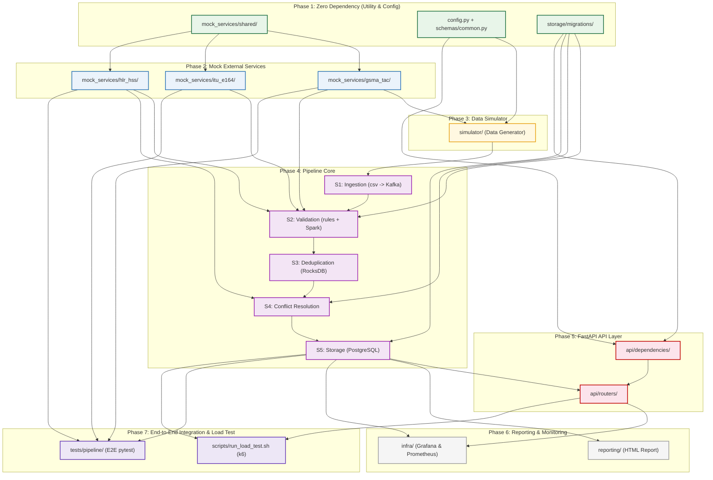

# Thứ tự Code & Bản đồ Phụ thuộc (Build Order & Dependency Map)
## CAMARA Network API Data Pipeline — 7 Phase · 20 Modules

Tài liệu này hướng dẫn chi tiết thứ tự phát triển (build order) và sơ đồ phụ thuộc giữa các module trong hệ thống **CAMARA Network API Data Pipeline**. Các module được thiết kế và sắp xếp theo lộ trình tối ưu hóa khả năng test độc lập, giảm thiểu phụ thuộc chéo và hỗ trợ phát triển song song hiệu quả.

---

## 🗺️ Sơ đồ phụ thuộc tổng quan (Dependency Graph)

---

## ⚡ Khả năng làm song song (Parallel Tracks)

> [!TIP]
> Để tăng tốc độ phát triển dự án, các phần sau có thể triển khai song song:
> - **Các module trong Phase 1** chạy song song độc lập hoàn toàn.
> - **Các mock services ở Phase 2** phát triển song song sau khi hoàn thành `mock_services/shared/` của Phase 1.
> - **Storage models** (`pipeline/storage/models.py`) có thể viết song song với **SQL migrations** (`storage/migrations/`).
> - **FastAPI Schema & Dependency** (`api/schemas/` và `api/dependencies/`) có thể viết song song trong khi đang code Phase 4.
> - **Hạ tầng giám sát** (`infra/` Grafana, Prometheus) có thể cấu hình song song khi làm Phase 5.

---

## 📋 Chi tiết từng giai đoạn (Phase Details)

### Phase 1: Zero Dependency — Code & Test hoàn toàn độc lập
*Giai đoạn nền tảng, chứa các utility thuần túy và cấu hình, không phụ thuộc vào database hay network.*

| Module | Đường dẫn / Tên file | Lý do có thể code trước | Cách test | Output cho module sau |
|---|---|---|---|---|
| **shared** | `mock_services/shared/` ↳ `health.py`, `pagination.py`, `errors.py` | Tiện ích dùng chung thuần (pure utility) — không import gì từ project. | `pytest unit`: test error format, test Page[T] generic, test fault-injection header parse. | Shared library sử dụng bởi 3 mock services ở Phase 2. |
| **config_models** | `simulator/config.py` + `api/schemas/common.py` ↳ `SimulatorConfig`, `PhoneNumber`, `ErrorResponse` | Cấu hình dạng Dataclass và Pydantic model thuần — zero external dependencies. | `pytest unit`: validate PhoneNumber chuẩn E.164, validate SimulatorConfig bounds. | Type contracts dùng xuyên suốt project. |
| **storage_migrations** | `storage/migrations/` ↳ `001_init_schema.sql`, `002_indexes.sql`, `003_partitions.sql` | SQL DDL thuần — viết và review offline, không cần service nào chạy. | Chạy trên PostgreSQL Docker đơn lẻ, kiểm tra `EXPLAIN ANALYZE` cho 3 query pattern chính. | Database Schema đã kiểm chứng — tất cả module sau đều build trên schema này. |

---

### Phase 2: Mock Services — Độc lập với pipeline, test với dữ liệu tĩnh
*Mô phỏng các API bên ngoài của bên thứ ba, chạy độc lập và không phụ thuộc vào Kafka/Spark.*

| Module | Đường dẫn / Tên file | Phụ thuộc | Lý do có thể code | Cách test | Output cho module sau |
|---|---|---|---|---|---|
| **gsma_tac** | `mock_services/gsma_tac/` ↳ `models.py`, `seed.py`, `router.py`, `app.py` | `shared` | Chỉ cần shared utility + file CSV tĩnh. Không cần database hay Kafka. | `pytest`: GET `/tac/{tac}` found/not-found, POST `/batch`, pagination, fault-injection. | HTTP API `:8100` — Dùng bởi simulator (Phase 3) và pipeline/validation (Phase 4). |
| **itu_e164** | `mock_services/itu_e164/` ↳ `models.py`, `seed.py`, `router.py`, `app.py` | `shared` | Chỉ cần shared + 2 CSV tĩnh (country codes, operator prefixes). Không lưu state. | `pytest`: POST `/validate` (valid/invalid/unknown CC, short number), POST `/validate/batch`. | HTTP API `:8300` — Dùng cho quy trình kiểm tra validation Rule R2 ở Phase 4. |
| **hlr_hss** | `mock_services/hlr_hss/` ↳ `models.py`, `seed.py`, `router.py`, `app.py` | `shared` | Chỉ cần shared + `subscribers.csv`. Cần dùng `seed=42` để khớp bộ sinh dữ liệu. | `pytest`: by-imsi/by-msisdn found/404, imsi-history length, batch-lookup mixed. | HTTP API `:8200` — Dùng cho Rule R3 và luồng conflict_resolution (Phase 4+). |

> [!WARNING]
> Kịch bản seed dữ liệu (`seed.py` của HLR/HSS) phải được chạy TRƯỚC KHI khởi động bộ sinh dữ liệu của simulator để đảm bảo chúng có chung tệp thuê bao (subscriber pool).

---

### Phase 3: Simulator — Bộ giả lập sinh log
*Tạo lập log thô mô phỏng các sự kiện mạng GGSN RADIUS.*

| Module | Đường dẫn / Tên file | Phụ thuộc | Lý do có thể code | Cách test | Output cho module sau |
|---|---|---|---|---|---|
| **simulator** | `simulator/` ↳ `generators.py`, `error_injectors.py`, `simulator.py` | `gsma_tac`, `config_models` | Cần gọi GET `/tac` của GSMA TAC Mock để tải danh sách mã TAC hợp lệ lúc khởi động. | **Integration test**: Chạy với `--records 10000 --seed 42`, kiểm tra file CSV đầu ra có đúng schema, tỷ lệ lỗi nằm trong khoảng ±1% so với config, mọi IMEI hợp lệ đều có TAC trong mock. | `data/radius_log.csv` — File log thô làm dữ liệu đầu vào cho pipeline xử lý. |

> [!NOTE]
> Module `error_injectors.py` có thể được code độc lập trước `generators.py` vì nó chỉ biến đổi bản ghi (record) đã được tạo sẵn để nhồi lỗi.

---

### Phase 4: Pipeline Core — Luồng xử lý dữ liệu Spark Streaming
*Xây dựng và kiểm thử tuần tự từng stage của luồng xử lý chính.*

| Module | Đường dẫn / Tên file | Phụ thuộc | Lý do có thể code | Cách test | Output cho module sau |
|---|---|---|---|---|---|
| **s1_ingestion** | `pipeline/ingestion/` ↳ `csv_reader.py`, `producer.py` | `simulator` | Chỉ cần Kafka đang chạy + file CSV từ simulator. Không cần DB hay mock API. | **Integration**: Đẩy 1,000 records → consume từ topic `radius.raw` → kiểm tra số lượng và phân vùng (partition key). | Topic Kafka `radius.raw` được đẩy dữ liệu thô liên tục. |
| **s2_validation** | `pipeline/validation/` ↳ `rules.py`, `validator.py` | `s1_ingestion`, `gsma_tac`, `hlr_hss`, `itu_e164`, `storage_migrations` | Chứa logic kiểm thử các luật nghiệp vụ (Rules). `rules.py` gọi 3 mock services, `validator.py` cần Kafka + Spark. | **Unit test `rules.py`**: Mock HTTP client bằng `httpx.MockTransport` để kiểm tra các rule độc lập mà không cần chạy mock API thật. **Integration test `validator.py`**: Cần chạy Kafka + 3 mock APIs. | Dữ liệu chia luồng và lưu vào database: `radius.valid`, `radius.invalid`, `invalid_log`. |
| **s3_dedup** | `pipeline/deduplication/` ↳ `state_manager.py`, `dedup_job.py` | `s2_validation` | Chỉ xử lý lọc trùng từ topic `radius.valid` qua Spark RocksDB State Store. Không gọi API ngoài. | **Integration**: Nhồi dữ liệu trùng hoàn toàn và trùng mấp mé (near-duplicate) vào `radius.valid` → kiểm tra chỉ 1 record đi tiếp vào `radius.dedup`, bảng `duplicate_log` ghi đúng số lượng. | Topic Kafka `radius.dedup` sạch dữ liệu trùng lặp. |
| **s4_conflict** | `pipeline/conflict_resolution/` ↳ `resolver.py`, `swap_detector.py` | `s3_dedup`, `hlr_hss`, `storage_migrations` | Xác định các xung đột SIM/Device. `swap_detector.py` cần gọi HLR/HSS mock lấy lịch sử IMSI. | **Unit test `resolver.py`**: Tạo dữ liệu giả lập conflict A/B/C → xác nhận kết quả định tuyến. **Integration**: Chạy kèm HLR/HSS mock + Kafka + Postgres. | Topic Kafka `radius.clean` + Bảng ghi nhận hoán đổi thiết bị `swap_event` + `conflict_log`. |
| **s5_storage** | `pipeline/storage/` ↳ `models.py`, `writer.py` | `s4_conflict`, `storage_migrations` | Ghi dữ liệu sạch cuối cùng vào cơ sở dữ liệu PostgreSQL đã được chạy migration. | **Integration**: Consume từ `radius.clean` → kiểm tra bảng `radius_sessions`, phân vùng tháng chuẩn, check câu lệnh query có tối ưu. | Bảng dữ liệu `radius_sessions` sẵn sàng để API truy vấn. |

---

### Phase 5: API Layer — FastAPI phục vụ CAMARA API
*Tầng phục vụ ứng dụng, cung cấp các endpoint SIM Swap, Device Swap và Number Verification.*

| Module | Đường dẫn / Tên file | Phụ thuộc | Lý do có thể code | Cách test | Output cho module sau |
|---|---|---|---|---|---|
| **api_deps** | `api/dependencies/` & `api/schemas/` ↳ `auth.py`, `database.py`, `sim_swap.py`,... | `storage_migrations`, `config_models` | Thiết lập xác thực API key (auth) và pool kết nối database (`asyncpg`), định nghĩa Pydantic schemas. | **Unit test**: Kiểm tra tính hợp lệ của API Key, các định dạng đầu vào (phoneNumber E.164, maxAge range). | Dependencies và schemas sẵn sàng nhúng vào routers. |
| **api_routers** | `api/routers/` + `api/main.py` ↳ `sim_swap.py`, `device_swap.py`, `health.py`,... | `s5_storage`, `api_deps` | Các router truy vấn dữ liệu trực tiếp từ PostgreSQL (bảng `radius_sessions` & `swap_event`). | **Integration test**: Tạo trước dữ liệu mẫu (mock data) trong Postgres test DB để chạy test suite độc lập mà không cần chờ pipeline chạy thực tế. | 3 endpoints CAMARA hoạt động tại cổng `:8000`. |

---

### Phase 6: Reporting & Observability — Báo cáo & Giám sát vận hành
*Các công cụ hỗ trợ báo cáo chất lượng dữ liệu và giám sát hệ thống thời gian thực.*

| Module | Đường dẫn / Tên file | Phụ thuộc | Mô tả hoạt động | Cách test | Output / Kết quả |
|---|---|---|---|---|---|
| **reporting** | `reporting/` ↳ `metrics_collector.py`, `quality_report.py`, Jinja2 template | `s5_storage` | Tổng hợp số liệu từ các bảng log (`invalid_log`, `duplicate_log`, `conflict_log`) để xuất báo cáo. | Tạo dữ liệu log giả lập trong Postgres → Chạy `quality_report.py` → Kiểm tra file báo cáo HTML. | Báo cáo HTML Data Quality Report hoàn chỉnh. |
| **infra_monitoring** | `infra/` (Prometheus & Grafana) ↳ `prometheus.yml`, `pipeline_dashboard.json` | `api_routers`, `s5_storage` | Thu thập metrics hiệu năng từ FastAPI, Spark và PostgreSQL. | Kiểm tra trạng thái Prometheus targets, verify giao diện Grafana hiển thị đầy đủ biểu đồ. | Dashboard hiển thị lượng throughput/latency trực tiếp. |

---

### Phase 7: End-to-End Integration & Load Test
*Đánh giá toàn diện hệ thống dưới tải trọng cao và kiểm thử tích hợp đầu cuối.*

| Module | Đường dẫn / Tên file | Phụ thuộc | Mô tả kịch bản | Kết quả mong đợi |
|---|---|---|---|---|
| **e2e_tests** | `tests/pipeline/` (TC23–TC33) ↳ `test_deduplication.py`, `test_validation.py`,... | `s5_storage`, `gsma_tac`, `hlr_hss`, `itu_e164` | Chạy toàn bộ stack hệ thống, đẩy bản ghi vào Kafka raw, đợi Spark xử lý và assert dữ liệu cuối trong Postgres. | Kiểm chứng tính chính xác của toàn bộ luồng pipeline. |
| **load_test** | `scripts/run_load_test.sh` ↳ Kịch bản k6 cho 3 endpoints | `api_routers`, `s5_storage` | Chạy thử nghiệm với 100 Virtual Users (VU) trong vòng 60s, kiểm tra hiệu năng khi PostgreSQL đã được nạp sẵn ~2M dòng dữ liệu. | Đảm bảo SLA: p95 SIM/Device Swap ≤ 200ms, Number Verification ≤ 100ms. |

---

## 📊 Tóm tắt khả năng Test độc lập (Mock / Dependency Table)

Bảng dưới đây thống kê mức độ độc lập khi kiểm thử của từng module, giúp các kỹ sư phát triển có thể xác định cần chuẩn bị những thành phần hạ tầng (infrastructure) nào khi phát triển module đó:

| Module | Mức độ kiểm thử độc lập | Thành phần hạ tầng cần thiết |
|---|---|---|
| **mock_services/shared/** | ✔ Hoàn toàn độc lập | Không cần |
| **simulator/config.py + api/schemas/common.py** | ✔ Hoàn toàn độc lập | Không cần |
| **storage/migrations/** | ✔ Gần như độc lập | Chỉ cần PostgreSQL (Docker đơn lẻ) |
| **mock_services/gsma_tac/** | ✔ Độc lập | Không cần (dùng dữ liệu CSV) |
| **mock_services/itu_e164/** | ✔ Độc lập | Không cần (dùng dữ liệu CSV) |
| **mock_services/hlr_hss/** | ✔ Độc lập | Không cần (dùng dữ liệu CSV) |
| **simulator/** | ⚠ Phụ thuộc Mock API | Cần chạy **GSMA TAC mock** (`:8100`) |
| **pipeline/ingestion/** | ⚠ Phụ thuộc Kafka | Cần chạy **Kafka broker** và file CSV giả lập |
| **pipeline/validation/ rules.py** | ✔ Unit test độc lập được | Sử dụng `httpx.MockTransport` (không cần Mock API thực) |
| **pipeline/validation/ (tích hợp)** | ⚠ Cần tích hợp | Cần Kafka + 3 Mock APIs + PostgreSQL |
| **pipeline/deduplication/** | ⚠ Cần Spark + Kafka | Cần Kafka + Spark Engine + PostgreSQL |
| **pipeline/conflict_resolution/** | ⚠ Cần tích hợp | Cần Kafka + Spark + HLR/HSS mock + PostgreSQL |
| **pipeline/storage/** | ⚠ Cần Storage | Cần Kafka + Spark + PostgreSQL |
| **api/ (unit test: auth & schemas)** | ✔ Hoàn toàn độc lập | Không cần |
| **api/ (integration test)** | ⚠ Cần Database | Chỉ cần PostgreSQL đã được nạp dữ liệu mẫu |
| **reporting/** | ⚠ Cần Database | Chỉ cần PostgreSQL chứa dữ liệu log |
| **tests/pipeline/ (E2E)** | ✗ Không độc lập | Phải chạy **toàn bộ stack hệ thống** |
| **load test (k6)** | ✗ Không độc lập | Toàn bộ stack đang chạy + nạp sẵn ~2M dòng dữ liệu |
