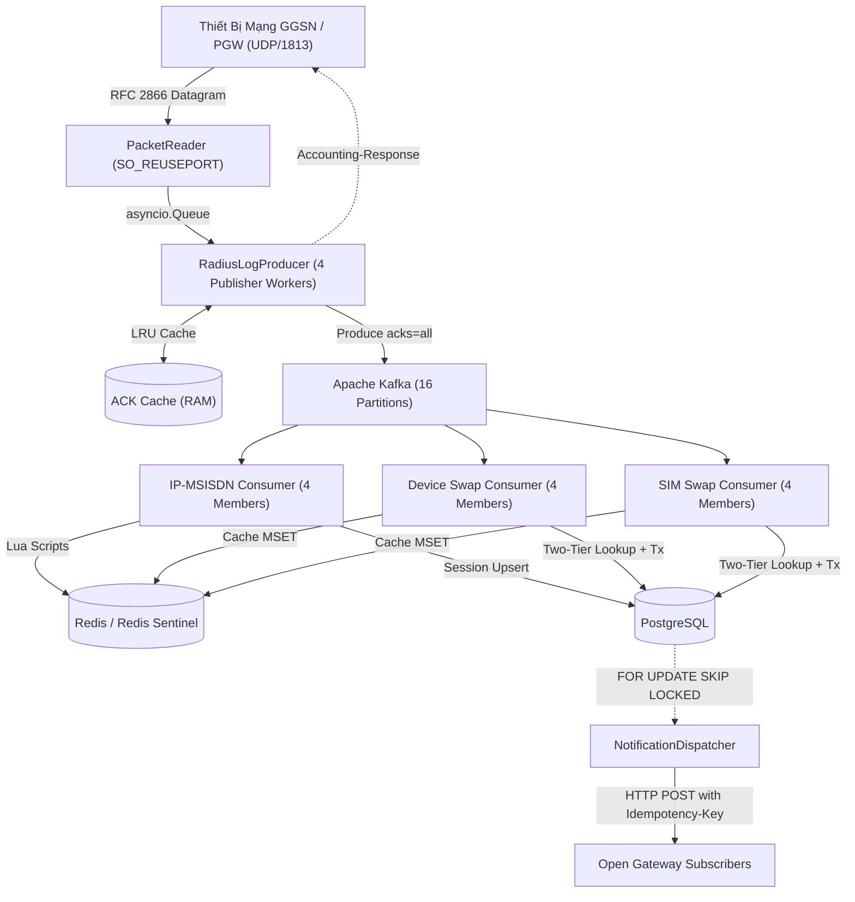
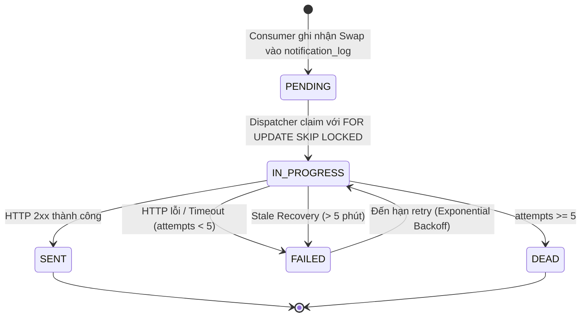

# BÁO CÁO KỸ THUẬT: CÁC KỸ THUẬT CHUYÊN SÂU TRONG CAMARA DATA PIPELINE

> **Tài liệu Kỹ thuật Dự án Viễn thông**: Báo cáo mô tả chi tiết toàn bộ các giải pháp kiến trúc, thuật toán và kỹ thuật tối ưu hóa hiệu năng được triển khai trong các module trọng điểm của CAMARA Data Pipeline.

---

## MỤC LỤC

1. [Tổng quan Kiến trúc Hệ thống](#1-tổng-quan-kiến-trúc-hệ-thống)
2. [Tầng Tiếp Nhận Dữ Liệu (Ingestion Layer)](#2-tầng-tiếp-nhận-dữ-liệu-ingestion-layer)
   - 2.1. `pipeline/ingestion/packet_reader.py`: Giải mã Nhị phân RFC 2866 & 3GPP VSA
   - 2.2. `pipeline/ingestion/producer.py`: Buffer Hàng đợi Bất đồng bộ, Deduplication ACK & Multi-worker Producer
3. [Tầng Hạ Tầng Dùng Chung (Shared Infrastructure)](#3-tầng-hạ-tầng-dùng-chung-shared-infrastructure)
   - 3.1. `pipeline/modules/shared/base_consumer.py`: Sharding Phân vùng Song song, Manual Commit & Đo Lag Bản Tin E2E
   - 3.2. `pipeline/modules/shared/db.py`: Giao dịch Nguyên tử 4 Bảng, Fencing Versioning & Batch UNNEST
   - 3.3. `pipeline/modules/shared/metrics.py`: Telemetry Đo lường Hai Tầng, Giám sát Thất thoát & Sliding Window Logger
4. [Tầng Xử Lý Nghiệp Vụ (Consumer Modules)](#4-tầng-xử-lý-nghiệp-vụ-consumer-modules)
   - 4.1. `pipeline/modules/ip_msisdn/`: Lua Scripts Nguyên tử, Reverse Index Sorted Set & Fencing Versioning
   - 4.2. `pipeline/modules/device_swap/` & `sim_swap/`: Tra cứu Trạng thái Hai Tầng, In-Batch State Mutation & Chuẩn hóa CAMARA
5. [Tầng Phân Phối Thông Báo (Transactional Outbox Dispatcher)](#5-tầng-phân-phối-thông-báo-transactional-outbox-dispatcher)
   - 5.1. `pipeline/dispatcher/notification_dispatcher.py`: Outbox Pattern, FOR UPDATE SKIP LOCKED & Tự Khôi Phục Sự Cố
6. [Bảng Tổng Hợp Kỹ Thuật Trọng Điểm](#6-bảng-tổng-hợp-kỹ-thuật-trọng-điểm)

---

## 1. Tổng quan Kiến trúc Hệ thống



---

## 2. Tầng Tiếp Nhận Dữ Liệu (Ingestion Layer)

### 2.1. `pipeline/ingestion/packet_reader.py` — Bộ Giải Mã Nhị Phân RADIUS RFC 2866 & 3GPP VSA

#### Kỹ thuật 1: Giải mã nhị phân không sử dụng thư viện ngoài (Zero-dependency Binary Parser)
- Đọc trực tiếp cấu trúc nhị phân 20-byte RADIUS Header theo định dạng Big-Endian (`struct.unpack`):
  - Byte 0: `Code` (4 = Accounting-Request, 5 = Accounting-Response).
  - Byte 1: `Identifier` (Mã định danh gói tin dùng để map với Response).
  - Byte 2–3: `Length` (Độ dài toàn bộ gói tin).
  - Byte 4–19: `Request Authenticator` (16 bytes chuỗi xác thực ngẫu nhiên).
- Duyệt vòng lặp bóc tách các cặp thuộc tính TLV (Type-Length-Value) với độ phức tạp $O(N)$ tuyến tính theo độ dài gói tin.

#### Kỹ thuật 2: Xử lý 3GPP Vendor-Specific Attributes (VSA Vendor ID = 10415)
- Giải mã lồng các thuộc tính con chuẩn mạng di động viễn thông (3GPP TS 29.061):
  - Subtype `1`: **`3GPP-IMSI`** (Chuỗi nhận dạng thuê bao di động quốc tế).
  - Subtype `20`: **`3GPP-IMEISV`** (Mã nhận dạng thiết bị phần cứng).
  - Subtype `21`: **`3GPP-RAT-Type`** (Loại sóng mạng: 1=UTRAN, 2=GERAN, 6=EUTRAN/LTE).
  - Subtype `8`: **`3GPP-SGSN-MCC-MNC`** (Mã mạng quốc gia và nhà mạng).

#### Kỹ thuật 3: Tính toán MD5 Response Authenticator theo chuẩn RFC 2866
- Gói tin phản hồi `Accounting-Response` (Code=5) được ký xác thực MD5:
  $$\text{Response Authenticator} = \text{MD5}(\text{Code} + \text{ID} + \text{Length} + \text{Request Authenticator} + \text{Attributes} + \text{Shared Secret})$$
- Đảm bảo thiết bị trạm GGSN/NAS xác thực được tính toàn vẹn và nguồn gốc phản hồi.

#### Kỹ thuật 4: Kernel Socket Load Balancing (`SO_REUSEPORT`) & Gắn Thẻ Thời Gian Ingest
- Socket UDP được cấu hình cờ `SO_REUSEPORT` và buffer nhận tối đa 32MB (`SO_RCVBUF`). Khi chạy nhiều tiến trình Ingestion trên Linux, Kernel tự động băm (hash) 4-tuple phân bổ gói tin đều cho các tiến trình mà không cần Proxy trung gian.
- Gắn nhãn thời gian tiếp nhận tức thời `ingest_timestamp` (chuẩn UTC ISO-8601) vào bản ghi phục vụ đo lường độ trễ bản tin End-to-End.

---

### 2.2. `pipeline/ingestion/producer.py` — Quản Lý Hàng Đợi Bất Đồng Bộ & Multi-worker Producer

#### Kỹ thuật 1: Hàng đợi RAM Giới Hạn & Cơ Chế Backpressure (Bounded RAM Queue)
- Sử dụng `asyncio.Queue(maxsize=100_000)` làm vùng đệm hấp thụ các đợt lưu lượng đột biến (burst traffic).
- Khi hàng đợi đạt ngưỡng giới hạn, hệ thống chủ động giữ ACK (withhold response) hoặc từ chối tạm thời (`queue_dropped`), kích hoạt cơ chế retry tự nhiên của thiết bị NAS qua giao thức UDP mà không làm tràn bộ nhớ RAM (OOM).

#### Kỹ thuật 2: Đa luồng Publisher Song Song (`RADIUS_UDP_PUBLISHER_WORKERS = 4`)
- Khởi chạy 4 coroutines `_publish_udp_batches` chạy song song cùng rút dữ liệu từ hàng đợi RAM và đẩy vào Kafka.
- Phá vỡ nút thắt "đường ống đơn" của 1 Event Loop, cho phép Kafka Producer duy trì thông lượng liên tục **>9.000 records/s** ngay cả khi một số batch đang chờ round-trip xác nhận.

#### Kỹ thuật 3: Bộ Nhớ Đệm Khử Trùng Lặp ACK (`_radius_ack_cache` LRU RAM)
- Quản lý 500.000 khóa định danh sự kiện (`radius_event_id`) trong bộ nhớ `OrderedDict` với thời gian sống TTL 120 giây.
- Khi nhận được gói tin retry từ NAS cho một sự kiện đã được ghi nhận vào Kafka trước đó, hệ thống **trả ngay Accounting-Response từ Cache RAM** mà không ghi trùng lặp vào Kafka, tiết kiệm 100% tài nguyên xử lý của tầng Consumer.

#### Kỹ thuật 4: Cam kết Độ Bền Vững Tuyệt Đối (`acks=all`, `enable_idempotence=True`)
- Producer cấu hình `acks="all"` (đồng thuận 3 broker replicas) kết hợp nén dữ liệu thuật toán `lz4`.
- Chỉ gửi `Accounting-Response` về cho thiết bị mạng **SAU KHI** Kafka Broker đã xác nhận ghi an toàn.

---

## 3. Tầng Hạ Tầng Dùng Chung (Shared Infrastructure)

### 3.1. `pipeline/modules/shared/base_consumer.py` — Lớp Cơ Sở Xử Lý Song Song & Đo Lag Bản Tin E2E

#### Kỹ thuật 1: Phân mảnh Phân vùng Song song (Partition-Concurrency Sharding)
- Khi nhận một tập hợp các partition từ `getmany()`, Consumer gom các partition thành $K$ shards (`PROCESSING_PARTITION_CONCURRENCY = 3`).
- Thực thi $K$ shards song song qua `asyncio.gather()`:
  - Các partition khác nhau được xử lý đồng thời.
  - Các bản ghi trong cùng một partition luôn được duyệt tuần tự theo thứ tự tăng dần của `offset`, đảm bảo tính đúng đắn về mặt thời gian cho từng thuê bao di động.

#### Kỹ thuật 2: Cam kết Offset Thủ Công (Manual Offset Commit) & Dead Letter Queue (DLQ)
- Tắt hoàn toàn `enable_auto_commit`. Offset chỉ được commit lên Kafka broker sau khi toàn bộ shard đã commit thành công vào cơ sở dữ liệu.
- Cơ chế Exponential Backoff Retry (thử lại tối đa 3 lần). Nếu một bản ghi hoặc shard bị lỗi cấu trúc dữ liệu không thể xử lý, nó được chuyển hướng tự động sang topic `<topic>.dlq` kèm toàn bộ payload và stack trace lỗi mà không làm dừng pipeline.

#### Kỹ thuật 3: Đo lường Độ trễ Bản tin Toàn trình (End-to-End Packet Processing Lag)
- Trích xuất `ingest_timestamp` từ mỗi bản ghi trong batch, so sánh với thời điểm hiện tại `now_utc` ngay sau khi hoàn tất ghi DB/Redis:
  $$\text{e2e\_lag\_ms} = (\text{now\_utc} - \text{record.ingest\_timestamp}) \times 1000$$
- Đo lường và thống kê độ trễ trung bình (`avg_ms`) và độ trễ lớn nhất (`max_ms`) cho từng cửa sổ giám sát, phản ánh chính xác thời gian gói tin di chuyển từ cổng mạng UDP qua Kafka tới khi nằm an toàn trong DB.

---

### 3.2. `pipeline/modules/shared/db.py` — Giao Dịch Nguyên Tử 4 Bảng & Fencing Versioning

#### Kỹ thuật 1: Quản lý Connection Pool Bất Đồng Bộ Duy Nhất (`asyncpg.Pool`)
- Sử dụng 1 connection pool duy nhất dùng chung cho toàn bộ $N$ consumer members trong cùng một tiến trình OS (cấu hình `min=6, max=32`), ngăn chặn tình trạng cạn kiệt socket kết nối tới PostgreSQL.

#### Kỹ thuật 2: Giao dịch Nguyên tử 4 Bảng trong Cùng một Transaction (`_persist_swap_batch`)
- Toàn bộ 4 thao tác ghi của một đợt phát hiện sự kiện Swap được đóng gói trong cùng một lệnh `connection.transaction()`:
  1. `_upsert_state`: Cập nhật trạng thái mới vào bảng `msisdn_device` hoặc `msisdn_sim`.
  2. `_insert_history`: Ghi nhật ký lịch sử vào `device_swap_history` hoặc `sim_swap_history`.
  3. `_insert_audit`: Ghi vết kiểm toán hệ thống vào `audit_log`.
  4. `_insert_outbox`: Ghi thông báo chờ gửi webhook vào `notification_log` (status `PENDING`).
- Đảm bảo tính toàn vẹn 100% theo chuẩn ACID: nếu có bất kỳ lỗi nào xảy ra, toàn bộ giao dịch được Rollback, không bao giờ có trạng thái "đổi state mà thiếu history hoặc notification".

#### Kỹ thuật 3: Tối ưu hóa Ghi Hàng Loạt bằng Mệnh đề `UNNEST`
- Thay vì gọi hàng trăm câu lệnh `INSERT`/`UPDATE` tuần tự, hệ thống gom toàn bộ mảng dữ liệu của batch thành các mảng nguyên thủy (arrays) và thực thi qua 1 câu lệnh SQL duy nhất bằng `UNNEST`:
  ```sql
  INSERT INTO msisdn_device (msisdn, imei_current, last_event_at, last_event_id, last_source_partition, last_source_offset)
  SELECT * FROM UNNEST($1::text[], $2::text[], $3::timestamptz[], $4::text[], $5::int[], $6::bigint[])
  ON CONFLICT (msisdn) DO UPDATE SET
      imei_current = EXCLUDED.imei_current,
      last_event_at = EXCLUDED.last_event_at,
      last_event_id = EXCLUDED.last_event_id,
      last_source_partition = EXCLUDED.last_source_partition,
      last_source_offset = EXCLUDED.last_source_offset
  WHERE (EXCLUDED.last_event_at, EXCLUDED.last_source_partition, EXCLUDED.last_source_offset) >
        (msisdn_device.last_event_at, msisdn_device.last_source_partition, msisdn_device.last_source_offset);
  ```

#### Kỹ thuật 4: Fencing Tuple 3 Thành Phần Chống Ghi Đè Gói Tin Đến Sai Thứ Tự
- Ràng buộc phiên bản so sánh tuple:
  $$(\text{incoming.last\_event\_at}, \text{incoming.last\_source\_partition}, \text{incoming.last\_source\_offset}) > (\text{current.last\_event\_at}, \text{current.last\_source\_partition}, \text{current.last\_source\_offset})$$
- Loại bỏ hoàn toàn nguy cơ dữ liệu cũ bị ghi đè lên dữ liệu mới khi mạng có hiện tượng retry hoặc gói tin bị trễ (Out-of-Order Delivery).

---

### 3.3. `pipeline/modules/shared/metrics.py` — Telemetry Đo Lường Hai Tầng & Giám Sát Thất Thoát

#### Kỹ thuật 1: Kiến trúc Đo Lường Kép (In-Memory Sliding Window + Prometheus Exporter)
- Tích hợp sẵn bộ đếm in-memory phục vụ in log sliding window định kỳ (10 giây) độc lập, đồng thời tự động xuất các Metrics chuẩn sang Prometheus scraper qua cổng 9200 (`Counter`, `Gauge`, `Histogram`).
- Lazy import an toàn: nếu môi trường không cài `prometheus_client`, module tự động fallback về in-memory logging mà không gây lỗi runtime.

#### Kỹ thuật 2: Phân Rã Độ Trễ Nội Bộ Từng Chặng (`latency_ms`)
- Đo đạc chính xác thời gian thực thi của từng chặng trong pipeline:
  - `state`: Thời gian tra cứu cache Redis / DB.
  - `postgres`: Thời gian thực thi giao dịch SQL.
  - `redis`: Thời gian cập nhật Redis pipeline / Lua scripts.
- Giúp người vận hành lập tức xác định chính xác vị trí nghẽn cổ chai khi hệ thống bị chậm.

#### Kỹ thuật 3: Định dạng Log Đọc Thân Thiện & Giám Sát Thất Thoát (Data Loss Monitoring)
- Cấu trúc log chuẩn hóa theo từng khối phân cách bằng ký tự `|`:
  ```
  [PROCESSING][cg-device-swap][member=1/4][OK] window=10.0s | Throughput: recv=1876.2/s success=1876.2/s (pg=0.0/s, rds=0.0/s) | Latency: batch_avg=37.8ms stage(state=37.2ms, pg=0.0ms, rds=0.0ms) e2e_lag=42.1ms(max=65.0ms) | Swaps/Events: device_swaps_total=0(+0) ignored=85944 | Quality/Loss: kafka_lag=0 data_loss=0(+0) (err=0, dlq=0) | Totals: recv=85944, ok=85944, pg=0, rds=0, batches=886
  ```
- Hiển thị trực quan chỉ số `data_loss` (tổng số record lỗi + DLQ), đảm bảo không bỏ sót bất kỳ bản ghi nào bị thất thoát.

---

## 4. Tầng Xử Lý Nghiệp Vụ (Consumer Modules)

### 4.1. `pipeline/modules/ip_msisdn/` — Quản Lý Phiên Mạng IP↔MSISDN (CAMARA Number Verification)

#### Kỹ thuật 1: Các Script Lua Thực Thi Nguyên Tử Trên Redis
- **`UPSERT_LUA`**: 
  - Kiểm tra `event_epoch` và `offset` trước khi ghi đè key `ip-ggsn:<ip>`.
  - Tự động cập nhật Reverse Index Sorted Set `ggsn-ips:<nas>` với score là epoch.
  - Tự động xóa mapping cũ nếu IP này trước đó từng thuộc về một trạm NAS khác.
- **`DELETE_LUA`**:
  - Kiểm tra điều kiện quyền sở hữu (Ownership Check): Chỉ xóa `ip-ggsn:<ip>` nếu số thuê bao `msisdn` trong Redis **trùng khớp 100%** với sự kiện `Stop`. Ngăn chặn việc gói tin `Stop` bị trễ vô tình xóa mất phiên mạng mới của thuê bao khác đã được cấp lại cùng địa chỉ IP.
- **`ACCOUNTING_OFF_LUA`**:
  - Khi một trạm trạm GGSN/NAS khởi động lại hoặc mất nguồn (sự kiện `Accounting-Off`), script quét Sorted Set và xóa hàng loạt tất cả các địa chỉ IP của trạm đó một cách nguyên tử.

#### Kỹ thuật 2: Lưu Trữ Trạng Thái Phiên Kép (Dual Storage Architecture)
- Redis: Lưu trữ Read Cache tốc độ cao phục vụ API truy vấn tức thời (`< 1ms`).
- PostgreSQL: Lưu trữ trạng thái phiên bền vững trong bảng `radius_session_state`, đảm bảo dữ liệu có thể phục hồi đầy đủ khi Redis gặp sự cố.

---

### 4.2. `pipeline/modules/device_swap/` & `sim_swap/` — Phát Hiện Đổi Thiết Bị (IMEI) & Đổi SIM (IMSI)

#### Kỹ thuật 1: Tra Cứu Trạng Thái Hai Tầng (Two-Tier State Lookup)
- **Tầng 1 (Redis Cache)**: Thực hiện `redis.mget()` lấy song song toàn bộ MSISDN trong batch qua đúng 1 round-trip mạng.
- **Tầng 2 (PostgreSQL Fallback)**: Chỉ đối với các MSISDN bị cache-miss, thực hiện 1 câu truy vấn SQL `WHERE msisdn = ANY($1::text[])`.

#### Kỹ thuật 2: Xử Lý Biến Đổi Trạng Thái Nội Bộ Batch (In-Batch State Mutation)
- Trong một batch lớn, nếu một số thuê bao đổi thiết bị hoặc đổi SIM nhiều lần liên tiếp, trạng thái in-memory được cập nhật ngay trong vòng lặp duyệt batch. Bản ghi thứ 2 sẽ luôn so sánh với kết quả mới nhất của bản ghi thứ 1.
- Gom nhóm theo `dict` để chỉ giữ lại bản ghi cuối cùng cho mỗi MSISDN khi thực thi câu lệnh SQL `ON CONFLICT DO UPDATE`, loại bỏ hoàn toàn lỗi `CardinalityViolationError`.

#### Kỹ thuật 3: Chuẩn Hóa Theo Tiêu Chuẩn CAMARA Open Gateway
- `sim_swap`: Lưu trữ trường `last_time_sim_change` trong cache Redis để phục vụ trực tiếp endpoint `GET /sim-swap/v0/retrieve-date`.
- Sinh payload thông báo theo đúng quy chuẩn CAMARA API với định dạng JSON chuẩn hóa.

---

## 5. Tầng Phân Phối Thông Báo (Transactional Outbox Dispatcher)

### 5.1. `pipeline/dispatcher/notification_dispatcher.py` — Webhook Dispatcher Độc Lập



#### Kỹ thuật 1: Tách Biệt Hoàn Toàn Khỏi Hot Path (Decoupled Outbox Worker)
- Các Consumer Kafka tuyệt đối không thực hiện HTTP Callbacks ra bên ngoài.
- Tiến trình `NotificationDispatcher` chạy hoàn toàn độc lập. Ngay cả khi máy chủ đối tác subscriber bị sập hoặc phản hồi chậm hàng chục giây, throughput của pipeline xử lý chính vẫn duy trì hàng chục nghìn gói tin/giây.

#### Kỹ thuật 2: Tranh Chấp Khóa Phi Tập Trung (`FOR UPDATE SKIP LOCKED`)
- Câu truy vấn claim notification:
  ```sql
  UPDATE notification_log
  SET status = 'IN_PROGRESS', locked_at = NOW(), attempts = attempts + 1
  WHERE id IN (
      SELECT id FROM notification_log
      WHERE (status = 'PENDING' OR (status = 'FAILED' AND next_retry_at <= NOW()))
      ORDER BY id
      LIMIT $1
      FOR UPDATE SKIP LOCKED
  )
  RETURNING id, event_id, payload, attempts, callback_url;
  ```
- Cho phép chạy nhiều instance Dispatcher song song (Horizontal Scale) mà không bao giờ bị trùng lặp bản ghi hay xảy ra Deadlock.

#### Kỹ thuật 3: Idempotency-Key & Exponential Backoff Retry
- Mỗi request HTTP POST đính kèm Header `Idempotency-Key: <event_id>`. Phía đối tác có thể nhận diện và loại bỏ trùng lặp nếu mạng có sự cố thử lại.
- Tự động tính toán thời gian thử lại: $\text{delay} = \min(2^{\text{attempts}}, 300) \text{ giây}$. Sau 5 lần thất bại liên tiếp, bản ghi chuyển sang trạng thái `DEAD` để giám sát viên can thiệp.

#### Kỹ thuật 4: Tự Phục Hồi Khi Worker Bị Sập (`recover_stale_notifications`)
- Quét định kỳ các bản ghi bị kẹt ở trạng thái `IN_PROGRESS` quá 5 phút (do tiến trình worker cũ bị SIGKILL hoặc sập nguồn) và tự động chuyển về `FAILED` để các worker khác tiếp tục xử lý.

---

## 6. Bảng Tổng Hợp Kỹ Thuật Trọng Điểm

| File / Module | Kỹ Thuật Trọng Điểm | Lợi Ích & Mục Đích Kỹ Thuật |
|---|---|---|
| [`packet_reader.py`](../pipeline/ingestion/packet_reader.py) | - RFC 2866 Binary TLV Parser<br/>- 3GPP VSA (Vendor 10415)<br/>- MD5 Authenticator<br/>- `SO_REUSEPORT` | - Giải mã cực nhanh không phụ thuộc thư viện ngoài<br/>- Kernel load-balancing đa tiến trình<br/>- Xác thực tính toàn vẹn gói tin |
| [`producer.py`](../pipeline/ingestion/producer.py) | - Bounded Queue Backpressure<br/>- 4 Publisher Workers<br/>- LRU ACK Cache (500k)<br/>- `acks=all` + LZ4 | - Hấp thụ burst traffic không gây OOM<br/>- Tăng thông lượng Kafka produce >9k/s<br/>- Khử trùng lặp gói tin retry từ NAS |
| [`base_consumer.py`](../pipeline/modules/shared/base_consumer.py) | - Partition Sharding (`asyncio.gather`)<br/>- Manual Offset Commit<br/>- DLQ Routing<br/>- Đo Lag Bản Tin E2E | - Khai thác tối đa I/O đa nhân<br/>- Chống mất mát dữ liệu khi sập nguồn<br/>- Đo lường chính xác độ trễ toàn trình |
| [`db.py`](../pipeline/modules/shared/db.py) | - Shared Connection Pool<br/>- Giao dịch 4 bảng nguyên tử<br/>- Batch `UNNEST` SQL<br/>- Fencing Versioning Tuple | - Tiết kiệm connection socket tới Postgres<br/>- Bảo đảm 100% tính toàn vẹn ACID<br/>- Ghi hàng loạt tốc độ cao (< 25ms/batch)<br/>- Chống ghi đè gói tin đến sai thứ tự |
| [`metrics.py`](../pipeline/modules/shared/metrics.py) | - In-Memory Sliding Window<br/>- Prometheus Exporter<br/>- Phân rã Latency từng chặng<br/>- Giám sát Data Loss | - Quan sát tức thời tình trạng hệ thống<br/>- Tích hợp chuẩn Dashboard Grafana<br/>- Phát hiện điểm nghẽn tức thì |
| [`ip_msisdn/`](../pipeline/modules/ip_msisdn/) | - Atomic Lua Scripts<br/>- Sorted Set Reverse Index<br/>- Ownership Check on Stop<br/>- Dual Storage Architecture | - Cập nhật Redis nguyên tử không race-condition<br/>- Thu hồi nhanh toàn bộ IP của trạm NAS<br/>- Khử sự kiện Stop đến sai thứ tự |
| [`device_swap/`](../pipeline/modules/device_swap/) & [`sim_swap/`](../pipeline/modules/sim_swap/) | - Two-Tier State Lookup<br/>- In-Batch State Mutation<br/>- CAMARA Payload Mapping<br/>- Cache `last_time_sim_change` | - Giảm 95% truy vấn trực tiếp xuống DB<br/>- Xử lý đúng nhiều lần đổi SIM/máy trong 1 batch<br/>- Tuân thủ 100% chuẩn CAMARA Open Gateway |
| [`notification_dispatcher.py`](../pipeline/dispatcher/notification_dispatcher.py) | - Transactional Outbox Pattern<br/>- `FOR UPDATE SKIP LOCKED`<br/>- Header `Idempotency-Key`<br/>- Stale Claim Self-Healing | - Cách ly hoàn toàn callback khỏi luồng chính<br/>- Scale ngang không bị deadlock<br/>- Tự phục hồi khi worker bị sập nguồn |
