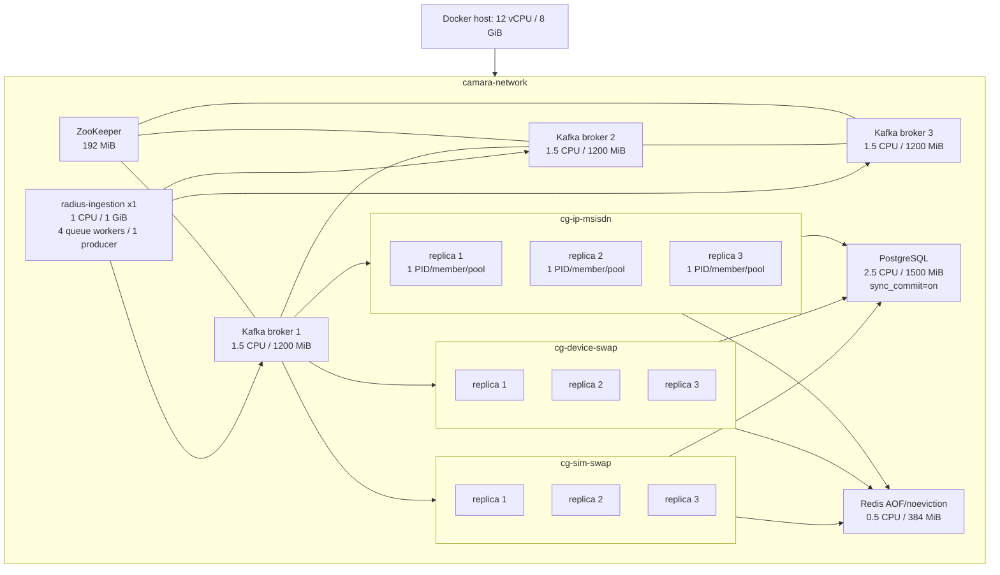
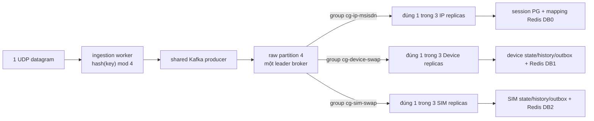
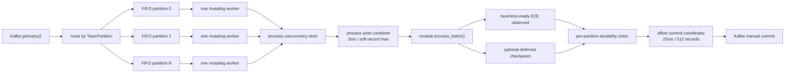
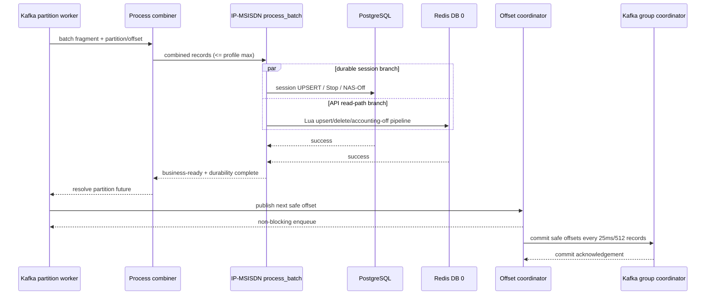
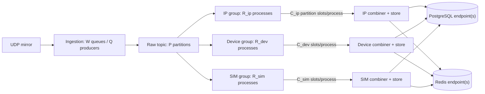

# Kiến trúc Pipeline và luồng dữ liệu thực tế

Tài liệu này mô tả đúng implementation hiện tại trong `pipeline/`,
`docker-compose.yml` và `config/env/*.env`. Phạm vi chính là từ lúc application
nhận mirror UDP/1813 đến lúc dữ liệu nghiệp vụ sẵn sàng cho API. Sender giả lập,
API và notification dispatcher chỉ được nhắc tới để làm rõ ranh giới.

## 1. Ranh giới trách nhiệm

- RADIUS capture server bên ngoài là nguồn bền vững, chịu trách nhiệm session
  RADIUS, Accounting-Response, lưu backlog và replay.
- `radius-ingestion` là passive mirror receiver. Nó không ACK RADIUS, không retry
  datagram và không hard-limit theo `PIPELINE_RECOMMENDED_*_PPS`.
- Queue ingestion nằm trong RAM và chỉ hấp thụ burst ngắn. UDP không có
  backpressure; nếu queue thật sự đầy thì `queue_dropped` là mất dữ liệu trong repo
  và capture phải replay.
- Kafka là durable hand-off nội bộ. Ba consumer group độc lập cùng đọc toàn bộ raw
  topic; một input record vì vậy tạo ba lượt xử lý nghiệp vụ, không phải producer
  gửi ba bản sao vào ba broker.
- PostgreSQL là hệ thống ghi bền và giữ transaction/outbox. Redis là state/read
  path nhanh. Hai storage dùng chung server vật lý nhưng mỗi process có client/pool
  riêng; Redis tách logical DB theo module.

## 2. Sơ đồ vật lý và logic

```mermaid
flowchart LR
    CAP["External RADIUS capture<br/>durable source + replay"] -->|"UDP mirror :1813"| SOCK["Kernel UDP socket"]
    TEST["radius_udp_sender.py<br/>test only"] -.->|"UDP fire-and-forget"| SOCK

    subgraph ING["radius-ingestion: một process"]
        SOCK --> DEC["PacketReader<br/>decode + validate AVP/VSA<br/>stamp ingest_epoch_ns"]
        DEC --> NORM["Normalize<br/>MSISDN + event timestamp"]
        NORM --> SHARD["hash(MSISDN) % publisher_workers"]
        SHARD --> Q1["bounded worker queue 1"]
        SHARD --> QN["bounded worker queue N"]
        Q1 --> MB1["micro-batch <=64<br/>wait <=1ms"]
        QN --> MBN["micro-batch <=64<br/>wait <=1ms"]
        MB1 --> KP["shared/sharded AIOKafkaProducer"]
        MBN --> KP
        DEC -. invalid .-> IDLQ["DLQ queue item"]
        IDLQ --> KP
    end

    subgraph KFK["Kafka cluster: 3 brokers"]
        RAW[("radius.accounting.raw<br/>key=MSISDN<br/>P partitions")]
        DLQ[("radius.accounting.raw.dlq")]
    end
    KP -->|"acks=1 by default"| RAW
    KP --> DLQ

    subgraph IPG["cg-ip-msisdn: R_ip processes"]
        IPC["1 member/PID<br/>partition FIFO + combiner"]
    end
    subgraph DEVG["cg-device-swap: R_dev processes"]
        DEVC["1 member/PID<br/>partition FIFO + combiner"]
    end
    subgraph SIMG["cg-sim-swap: R_sim processes"]
        SIMC["1 member/PID<br/>partition FIFO + combiner"]
    end

    RAW --> IPG
    RAW --> DEVG
    RAW --> SIMG

    IPC -->|"session state"| PG[(PostgreSQL)]
    IPC -->|"IP mapping Lua"| R0[("Redis DB 0")]
    DEVC -->|"swap tx / checkpoint"| PG
    DEVC -->|"device state"| R1[("Redis DB 1")]
    SIMC -->|"swap tx / checkpoint"| PG
    SIMC -->|"SIM state"| R2[("Redis DB 2")]

    PG --> OUTBOX[(notification_log)]
    OUTBOX --> DISP["NotificationDispatcher"]
    R0 --> API["CAMARA API"]
    R1 --> API
    R2 --> API
    PG --> API
```



`P` và số process thay đổi theo profile. Kafka chọn đúng một partition cho mỗi
record dựa trên key; broker đang giữ leader của partition đó nhận record. Ba group
consumer có offset riêng và fan-out logic xảy ra ở Kafka consumer groups.

### 2.1. Triển khai cụ thể trên host 12 CPU / 8 GiB

Sơ đồ dưới đây tương ứng chính xác với lệnh:

```bash
bash scripts/reset.sh config/env/8gb.env
bash scripts/run_pipeline.sh config/env/8gb.env
```



Các broker/PG/Redis/ingestion có hard CPU quota tổng danh nghĩa 8,5 CPU. Chín
pipeline replica không có `cpus` hard quota; chúng dùng `cpu_shares` (IP 1024,
Device/SIM 768) và tranh chấp phần CPU còn lại/các chu kỳ nhàn rỗi. Vì vậy không
được cộng `cpu_shares` như reservation CPU. Mục tiêu là tránh CFS throttle dưới
một core làm xấu p95, không phải cam kết rằng tổng container luôn dưới 12 CPU.

Topology dữ liệu của profile 8 GiB:

| Thuộc tính | Giá trị thực |
|---|---:|
| Raw partitions | 9 |
| Raw replication factor | 1 (benchmark single-host, không HA) |
| Replica mỗi consumer group | 3 |
| Partition trung bình/member | 3 |
| Partition concurrency/member | 3 |
| IP batch/wait | 48 / 5ms |
| Device/SIM batch/wait | 64 / 5ms |
| Process combiner | 2ms / 64 record |
| Offset commit coordinator | 25ms / 512 record |
| Swap checkpoint | 150ms / 256 state |
| DB pool tối đa | 4/replica; 36 connection cho chín pipeline replica |

### 2.2. Một record đi đâu trong profile 12 CPU

Ví dụ record có `MSISDN=+84901234567` được Kafka hash vào partition 4:



Producer chỉ ghi **một** record vào **một** partition. Kafka replication chép log
theo RF của topic; đó không phải ba bản nghiệp vụ. Ba lượt xử lý xuất hiện vì ba
consumer group có offset độc lập. Trong mỗi group, partition 4 chỉ thuộc một
member tại một thời điểm.

## 3. Luồng ingestion, từng bước

1. `PacketReader` gọi `sock_recvfrom()` và đóng dấu `ingest_epoch_ns` ngay sau khi
   application nhận datagram. Đây là mốc bắt đầu E2E.
2. Packet được decode theo RADIUS Accounting/3GPP VSA. Record không hợp lệ được
   bọc metadata lỗi và gửi topic `.dlq` qua cùng hạ tầng queue/publisher.
3. `RadiusLogProducer._normalize()` chuẩn hóa MSISDN, `event_timestamp` và giữ mốc
   ingest trong payload Kafka.
4. Record hợp lệ được route bằng `hash(msisdn) % publisher_workers`. Cùng một key
   luôn tới cùng worker queue trong vòng đời process, giúp không đảo thứ tự trước
   Kafka. Record không có key dùng round-robin.
5. Mỗi worker queue có kích thước xấp xỉ
   `RADIUS_UDP_QUEUE_MAX_RECORDS / RADIUS_UDP_PUBLISHER_WORKERS`. Tổng queue được
   log dưới dạng một capacity logic.
6. Publisher gom tối đa `RADIUS_UDP_KAFKA_BATCH_RECORDS` hoặc chờ tối đa
   `RADIUS_UDP_KAFKA_BATCH_WAIT_MS`. Đây là publish group phía application; Kafka
   producer accumulator còn có thể gộp tiếp theo partition/byte.
7. Mỗi worker có inflight limit và tất cả worker cùng chịu global inflight
   semaphore. Khi queue shard đạt pressure ratio, worker dùng pressure inflight
   limit. Các limit này bảo vệ RAM/Kafka; chúng không phải PPS admission control.
8. Khi Kafka future hoàn tất, record mới tăng `kafka_persisted`. Với `acks=1`, đây
   là leader acknowledgement; độ bền end-to-end vẫn dựa vào capture/replay.
9. `queue_dropped` chỉ tăng khi worker queue thật sự đầy. `publish_failed` chỉ tăng
   khi enqueue/persist Kafka thất bại. `PIPELINE_RECOMMENDED_*_PPS` chỉ tạo cảnh
   báo `CAPACITY_TARGET_EXCEEDED` và không bỏ record.

CSV direct ingestion là đường benchmark khác: đọc record, normalize rồi gửi thẳng
Kafka theo các future group; nó không đi qua UDP socket/worker queues.

## 4. Kafka partitioning và fan-out ba nghiệp vụ

- Topic raw dùng `key=MSISDN`, nên mọi record của một thuê bao vào cùng partition.
- Thứ tự được bảo đảm trong partition, không phải trên toàn topic.
- Mỗi module có consumer group riêng: `cg-ip-msisdn`, `cg-device-swap`,
  `cg-sim-swap`. Vì group id khác nhau, cả ba đều nhận cùng record.
- Trong một group, Kafka gán mỗi partition cho đúng một member. Không có một
  partition được xử lý đồng thời bởi hai replica cùng group.
- `CONSUMERS_PER_GROUP` bắt buộc bằng `1` trong mỗi process. Scale multi-core bằng
  `PIPELINE_IP_REPLICAS`, `PIPELINE_DEVICE_REPLICAS`, `PIPELINE_SIM_REPLICAS`.
- Số replica hữu ích không vượt số partition. Mục tiêu profile là chia partition
  gần đều và đặt partition concurrency bằng số partition trung bình mỗi replica.

## 5. Temporal pipeline trong một consumer process



Chi tiết:

- `getmany()` chỉ fetch và route. Mỗi partition có một FIFO và đúng một worker
  thay đổi state, vì vậy offset không bị đảo.
- Các partition độc lập chạy song song qua semaphore
  `PROCESSING_PARTITION_CONCURRENCY`.
- Worker coalesce fragment liên tiếp của chính partition đến `BATCH_MAX_RECORDS`.
- Write combiner gom request từ nhiều partition độc lập tối đa
  `PROCESSING_COMBINE_WAIT_MS`/`PROCESSING_COMBINE_MAX_RECORDS`, rồi gọi module một
  lần. Future riêng trả kết quả cho từng partition; batch kế tiếp của partition đó
  không vượt batch trước.
- Khi FIFO vượt high watermark hoặc record cũ nhất vượt age threshold, consumer
  pause riêng partition. Resume dùng low watermark và tuổi nhỏ hơn để tránh
  flapping. Backlog bền vẫn ở Kafka.
- Business E2E kết thúc sau `process_batch()` khi state cần cho API đã sẵn sàng.
  Offset commit chạy nền và không được cộng vào business E2E.
- Offset chỉ được công bố sau deferred durability (nếu có). Crash/rebalance trước
  commit gây replay; version fence và event id làm write lặp lại an toàn.

## 6. Luồng IP-MSISDN

1. Parse status, MSISDN, framed IP, NAS, session id và event time.
2. Record lỗi được gửi DLQ; `Accounting-On` không tạo thay đổi.
3. `Start`/`Interim-Update` cập nhật session state PostgreSQL và tạo Redis upsert.
4. `Stop` đánh dấu session không active và xóa mapping Redis nếu owner/version
   vẫn khớp.
5. `Accounting-Off` ghi NAS watermark, đánh dấu các session của NAS inactive và
   xóa mapping Redis theo NAS.
6. Cùng session trong một combined batch được deduplicate, giữ version mới nhất để
   tránh PostgreSQL cardinality violation.
7. Nhánh PostgreSQL và Redis chạy đồng thời bằng `asyncio.gather()`. Cả hai phải
   thành công; nếu một nhánh lỗi, batch fail và offset chưa commit.

Redis DB 0 dùng Lua/version fence cho mapping `ip-ggsn:*` và index
`ggsn-ips:*`. PostgreSQL giữ `radius_session_state` và NAS-off watermark.

## 7. Luồng Device Swap và SIM Swap

Hai module dùng cùng mô hình, khác thuộc tính so sánh: Device dùng IMEI, SIM dùng
IMSI.

1. Parse `(MSISDN, IMEI|IMSI, event_time, event_id, partition, offset)`.
2. MGET state từ Redis DB 1 hoặc DB 2; cache miss mới fallback PostgreSQL theo
   batch.
3. So sánh version tuple `(event_time, partition, offset)` và event id. Replay hoặc
   stale record bị bỏ qua nghiệp vụ nhưng watermark vẫn được checkpoint an toàn.
4. Nếu chưa có state hoặc giá trị không đổi: cập nhật Redis ngay cho read path và
   gửi state mới nhất vào `StateCheckpointCoordinator`. Coordinator deduplicate theo
   MSISDN rồi bulk UPSERT PostgreSQL mỗi interval/max-records. Không mở transaction
   history/audit/outbox cho mỗi record không đổi.
5. Nếu giá trị đổi thật: PostgreSQL chạy một transaction nguyên tử gồm state,
   history, audit và outbox. Chỉ sau transaction thành công Redis mới publish state
   mới; thứ tự này ngăn cache-ahead làm retry bỏ sót history/outbox.
6. `events_detected` chỉ tăng cho swap thật. `same_value` và `stale` giải thích
   `ignored`; chúng không phải data loss.
7. E2E business-ready của no-change path kết thúc sau Redis. Offset vẫn chờ future
   checkpoint PostgreSQL, nên crash có thể replay nhưng không làm mất durability.

## 8. Storage, transaction và read path

| Module | PostgreSQL | Redis | Ghi đồng thời/tuần tự |
|---|---|---|---|
| IP-MSISDN | session state + NAS watermark | DB 0 IP mapping | PG và Redis song song, cùng phải thành công |
| Device Swap | state/history/audit/outbox hoặc checkpoint | DB 1 device state | swap: PG trước Redis; no-change: Redis + checkpoint nền |
| SIM Swap | state/history/audit/outbox hoặc checkpoint | DB 2 SIM state | swap: PG trước Redis; no-change: Redis + checkpoint nền |

Mỗi replica sở hữu `asyncpg.Pool`, Redis client, Kafka consumer, DLQ producer,
combiner và commit/checkpoint coordinator riêng. PostgreSQL vật lý vẫn dùng chung
để giữ atomicity của state/history/audit/outbox. Redis logical DB tách keyspace,
không tạo ba Redis server độc lập.

### 8.1. Tương tác IP-MSISDN theo trình tự



Nếu một nhánh PG/Redis lỗi, `process_batch()` lỗi, offset không được công bố và
batch được retry. E2E business-ready được quan sát sau khi cả hai nhánh thành
công; Kafka offset RTT không nằm trong E2E.

### 8.2. Tương tác swap: fast path và swap thật

```mermaid
sequenceDiagram
    participant K as Partition worker
    participant M as Device/SIM module
    participant R as Redis DB 1/2
    participant P as PostgreSQL
    participant Q as Checkpoint coordinator
    participant O as Offset coordinator
    participant KC as Kafka group coordinator

    K->>M: ordered records
    M->>R: MGET state by MSISDN
    alt Redis miss
        M->>P: SELECT state WHERE msisdn = ANY(...)
        P-->>M: fallback state
    end

    alt first-seen or same IMEI/IMSI
        M->>R: MSET/versioned state
        R-->>M: business-ready
        M->>Q: enqueue latest state + durability future
        Q->>P: coalesced bulk UPSERT (150ms/max records)
        P-->>Q: durable checkpoint
        Q-->>O: offset becomes committable
    else real newer swap
        M->>P: BEGIN; state + history + audit + outbox; COMMIT
        P-->>M: atomic transaction committed
        M->>R: publish new read state
        R-->>M: business-ready + durable
        M->>O: offset becomes committable
    else stale or duplicate
        M->>O: no mutation; offset becomes committable
    end
    O->>KC: coalesced manual commit
```

Đường no-change không mở transaction history/audit/outbox cho từng record. Đường
swap thật cố ý PG trước Redis để cache không đi trước history/outbox. Offset của
no-change vẫn bị durability future của checkpoint chặn, dù business-ready E2E đã
kết thúc sau Redis.

## 9. Định nghĩa latency và loss

- `pre_process_p95`: từ `ingest_epoch_ns` đến lúc combined batch bắt đầu
  `process_batch()`; gồm ingestion, Kafka và consumer queue/scheduling.
- `processing_p95`: thời gian thực thi `process_batch()`; không gồm offset commit.
- `e2e_avg/p95/max`: từ UDP application receive đến business-ready store.
- `OffsetCommit p95`: Kafka bookkeeping/replay window, báo riêng ngoài E2E.
- `Checkpoint p95/queue_p95`: deferred PostgreSQL watermark của no-change swap,
  báo riêng; offset không vượt checkpoint chưa hoàn tất.
- Ingestion `data_loss = queue_dropped + publish_failed`. Processing
  `data_loss = errors + dlq`. Hai metric ở hai stage không được cộng mù nếu cùng
  một record lỗi đã được phản ánh ở cả hai nơi.

## 10. Topology theo hardware profile

| Profile | Partitions | Replica mỗi group | Partition/member | Concurrency | Batch IP / Swap | Combiner |
|---|---:|---:|---:|---:|---:|---:|
| 8 GiB / 12 CPU | 9 | 3 | 3 | 3 | 48 / 64, wait 5ms | 2ms / 64 |
| 16 GiB / 16 CPU | 12 | 4 | 3 | 3 | 48 / 64, wait 5ms | 2ms / 64 |
| 32 GiB / 24 CPU | 24 | 6 | 4 | 4 | 48 / 64, wait 5ms | 2ms / 96 |
| 64 GiB / 32 CPU | 48 | 8 | 6 | 6 | 48 / 64, wait 5ms | 2ms / 128 |

Các throughput trong profile là candidate capacity target dùng cho log và test,
không phải hard limit hoặc cam kết. Chỉ chứng nhận sau soak test trên phần cứng
đích với E2E event-level p95 <100ms, loss=0, Kafka lag không tăng và không có UDP
kernel drop.

### 10.1. Sơ đồ tổng quát cho mọi profile



Với từng group, điều kiện topology là:

```text
1 <= replicas R <= partitions P
partition trung bình/member = ceil(P / R)
partition concurrency C <= partition được gán/member
CONSUMERS_PER_GROUP = 1 trong mọi PID
DB connection pipeline = sum(R_module * pool_max_module)
```

Khi tăng profile, scale partition và process cùng nhau. Tăng `C` chỉ hữu ích nếu
member thật sự được gán đủ partition và còn CPU/I/O; tăng `R` vượt `P` tạo member
rỗi. Cùng key vẫn vào một partition nên không thể song song hóa các event của một
thuê bao mà không thay đổi mô hình nhất quán.

### 10.2. Tham số triển khai tổng quát

| Profile | Ingestion W/Q | Kafka P/RF | Group replicas | C/member | Pool IP/Dev/SIM | Queue RAM |
|---|---:|---:|---:|---:|---:|---:|
| 12 CPU / 8 GiB | 4/1 | 9/1 | 3/3/3 | 3 | 4/4/4 | 20k |
| 16 CPU / 16 GiB | 4/1 | 12/3 | 4/4/4 | 3 | 8/4/4 | 30k |
| 24 CPU / 32 GiB | 8/2 | 24/3 | 6/6/6 | 4 | 12/5/5 | 60k |
| 32 CPU / 64 GiB | 8/4 | 48/3 | 8/8/8 | 6 | 16/7/7 | 120k |

`W/Q` là publisher workers/Kafka producers. Queue RAM chỉ là burst absorber.
Các endpoint PG/Redis có thể được route riêng theo module qua
`*_DATABASE_URL`/`*_REDIS_HOST`; Compose mặc định vẫn dùng một PostgreSQL và một
Redis vật lý để vận hành local/single-host.

## 11. Nạp profile và vòng đời cấu hình

Scripts nạp `.env` trước, sau đó nạp profile được chọn. Profile vì vậy chỉ cần
override tài nguyên/topology, không chứa secret:

```bash
bash scripts/reset.sh config/env/16gb.env
bash scripts/run_pipeline.sh config/env/16gb.env
```

Phải dùng cùng profile cho reset và run để topic được tạo đúng partition. Kafka
không hỗ trợ giảm partition; đổi topology trên topic cũ phải dùng quy trình migrate
topic hoặc reset dữ liệu benchmark. Xem `config/env/README.md` cho validation và
connection/memory budget từng profile.
