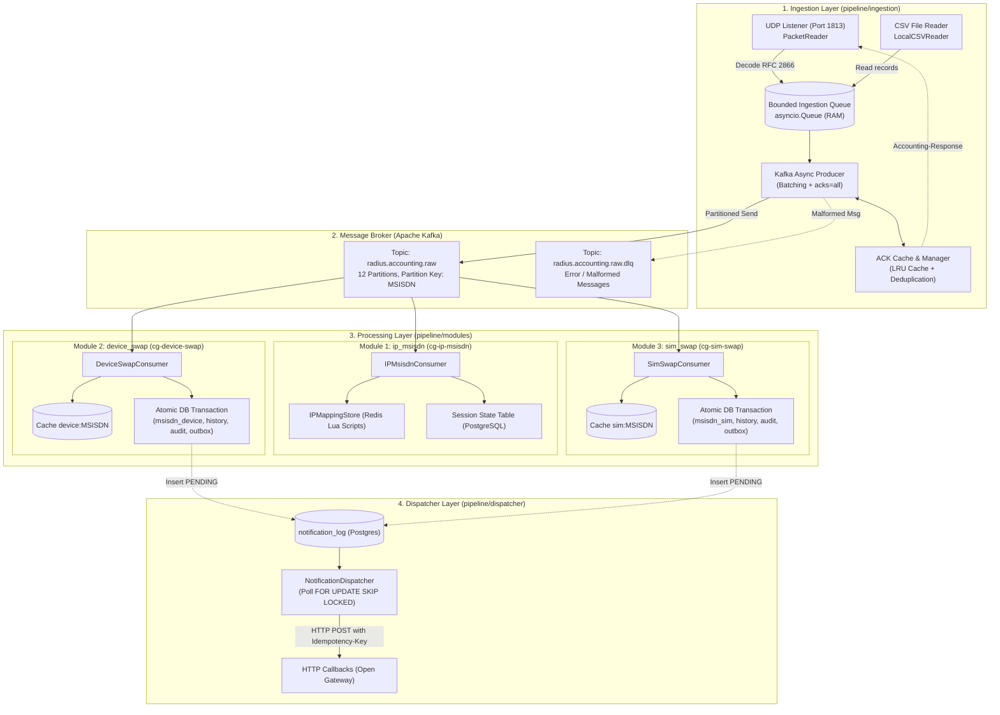
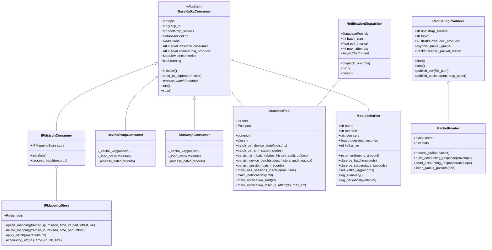

# `pipeline/` — Lõi Xử Lý Dữ Liệu RADIUS Accounting

Thư mục `pipeline/` chứa toàn bộ logic tiếp nhận dữ liệu RADIUS Accounting từ thiết bị mạng viễn thông (hoặc file CSV), đưa vào message broker Apache Kafka, phân phối và xử lý song song qua 3 Consumer Modules độc lập, cập nhật trạng thái vào cơ sở dữ liệu PostgreSQL / Redis, và phân phối webhook callback qua Transactional Outbox Dispatcher.

---

## 1. Kiến trúc phân tầng & Luồng dữ liệu (Pipeline Data Flow)



---

## 2. Sơ đồ quan hệ lớp (Class Diagram)



---

## 3. Các thành phần chính trong `pipeline/`

| Thư mục / File | Vai Trò & Chức Năng | Cách Thức Chạy |
|---|---|---|
| [`run_pipeline.py`](run_pipeline.py) | **Orchestrator chính**: Khởi tạo DatabasePool dùng chung, start HTTP metrics server, và chạy song song $N$ worker instances cho cả 3 Consumer Groups. | `python -m pipeline.run_pipeline [--duration N]` |
| [`ingestion/`](ingestion/) | **Stage 1 (Ingestion)**: Tiếp nhận dữ liệu CSV hoặc gói tin UDP RADIUS, giải mã binary RFC 2866, đẩy vào Kafka topic `radius.accounting.raw` kèm cơ chế backpressure và deduplication ACK. | Chạy độc lập: `python -m pipeline.ingestion.producer --udp --port 1813` |
| [`modules/shared/`](modules/shared/) | **Hạ tầng dùng chung**: `BaseKafkaConsumer`, `DatabasePool` (quản lý connection pool + transaction), `ModuleMetrics` (Prometheus exporter), `redis_client`, `events` normalization. | Được import bởi 3 modules con. |
| [`modules/ip_msisdn/`](modules/ip_msisdn/) | **Module 1 (IP↔MSISDN)**: Quản lý ánh xạ IP nguồn với MSISDN theo phiên mạng, chạy Lua Scripts trên Redis và lưu session state vào Postgres. | Task con của `run_pipeline.py`, group `cg-ip-msisdn`. |
| [`modules/device_swap/`](modules/device_swap/) | **Module 2 (Device Swap)**: Theo dõi IMEI của từng MSISDN, phát hiện đổi máy, ghi nhận lịch sử và tạo Outbox event. | Task con của `run_pipeline.py`, group `cg-device-swap`. |
| [`modules/sim_swap/`](modules/sim_swap/) | **Module 3 (SIM Swap)**: Theo dõi IMSI của từng MSISDN, phát hiện đổi SIM, ghi nhận lịch sử và tạo Outbox event. | Task con của `run_pipeline.py`, group `cg-sim-swap`. |
| [`dispatcher/`](dispatcher/) | **Stage 3 (Event Dispatcher)**: Tiến trình worker độc lập poll bảng `notification_log` và gửi HTTP Webhook callback tới các subscriber Open Gateway. | **Chạy độc lập**: `python -m pipeline.dispatcher.notification_dispatcher` |

---

## 4. Mô hình xử lý song song & Quản lý tiến trình (`run_pipeline.py`)

1. **Khởi tạo hạ tầng & Topics**:
   - `run_pipeline.py` sử dụng `AIOKafkaAdminClient` tự động tạo topic `radius.accounting.raw` và `radius.accounting.raw.dlq` với số partition cấu hình (`KAFKA_TOPIC_PARTITIONS=16`).
   - Mở cổng Prometheus Metrics (`METRICS_PORT=9200`).
2. **Khởi tạo Shared Database Connection Pool**:
   - Tạo **1 đối tượng `DatabasePool` duy nhất** (pool size `min=6, max=32`) và truyền vào tất cả các consumer instances trong process, tránh lãng phí connection socket tới PostgreSQL.
3. **Mô hình Multi-Member Consumer Group**:
   - Cấu hình `CONSUMERS_PER_GROUP` (mặc định = 4). Hệ thống tạo $3 \times \text{CONSUMERS\_PER\_GROUP} = 12$ consumer tasks chạy song song trong cùng Event Loop.
   - Mỗi consumer instance là một Kafka Member độc lập, Kafka Broker tự động rebalance phân chia 16 partitions cho các members.
4. **Xử lý Partition-Sharding trong Consumer**:
   - Trong mỗi lần `getmany()`, các partitions nhận được gom thành `PROCESSING_PARTITION_CONCURRENCY` shards (mặc định = 3) chạy song song (`asyncio.gather`), trong khi thứ tự offset trong từng partition luôn được bảo toàn nghiêm ngặt.
5. **Giám sát Supervisor & Graceful Shutdown**:
   - Lắng nghe tín hiệu `SIGINT`/`SIGTERM` tập trung tại Orchestrator.
   - Nếu bất kỳ consumer nào gặp sự cố chưa được bắt (Unhandled Exception), Supervisor sẽ kích hoạt fail-fast dừng an toàn toàn bộ pipeline, đóng Database Pool và flush metrics.

---

## 5. Định dạng Telemetry & Throughput Logging

Hệ thống ghi log định kỳ mỗi `THROUGHPUT_LOG_INTERVAL_SECONDS` (10s) theo định dạng phân khối trực quan bằng ký tự `|`:

```
[PROCESSING][<group-id>][member=<m>/<n>][OK|ERROR] window=10.0s | Throughput: recv=1876.2/s success=1876.2/s (pg=939.1/s, rds=1874.6/s) | Latency: batch_avg=37.8ms stage(state=37.2ms, pg=0.0ms, rds=0.0ms) e2e_lag=42.1ms(max=65.0ms) | Swaps/Events: <events_total>=0(+0) ignored=85944 | Quality/Loss: kafka_lag=0 data_loss=0(+0) (err=0, dlq=0) | Totals: recv=85944, ok=85944, pg=43046, rds=85887, batches=886
```

### Các trường đo lường chính:
- **`Throughput`**: Tốc độ nhận message (`recv`), tốc độ xử lý thành công (`success`), tốc độ ghi thực tế xuống PostgreSQL (`pg`) và Redis (`rds`).
- **`Latency`**: 
  - `batch_avg`: Thời gian xử lý trung bình 1 batch trong consumer (ms).
  - `stage(state, pg, rds)`: Phân rã độ trễ chi tiết từng chặng nội bộ (đọc cache state, ghi PostgreSQL, cập nhật Redis).
  - `e2e_lag(max)`: **Độ trễ bản tin toàn trình (End-to-End Packet Processing Lag)** — đo chính xác thời gian từ lúc gói tin UDP đi vào Ingestion (`ingest_timestamp`) đến khi hoàn tất ghi DB/Redis.
- **`Swaps/Events`**: Số lượng sự kiện nghiệp vụ phát hiện mới trong cửa sổ đo (`+delta`) và tổng tích lũy (`sim_swaps_total`, `device_swaps_total`, `mapping_events_total`), cùng số bản ghi `ignored` (không đổi SIM/máy).
- **`Quality/Loss`**:
  - `kafka_lag`: Số bản ghi còn tồn đọng so với High Watermark của partition.
  - `data_loss`: **Tổng số lượng bản ghi bị thất thoát/lỗi** (`data_loss = errors + dlq`).
- **`Totals`**: Tổng số lượng bản ghi lũy kế từ lúc tiến trình khởi động.

> 📖 **Báo cáo Kỹ thuật Chuyên sâu**: Xem chi tiết toàn bộ các giải pháp kỹ thuật và thuật toán triển khai trong từng file tại [`docs/BAO_CAO_KY_THUAT_PIPELINE.md`](../docs/BAO_CAO_KY_THUAT_PIPELINE.md).

---

## 6. Hướng dẫn vận hành

```bash
# Chạy toàn bộ 3 consumer modules
python -m pipeline.run_pipeline

# Chạy với thời gian định trước (ví dụ 60 giây để kiểm thử)
python -m pipeline.run_pipeline --duration 60

# Chạy Notification Dispatcher (gửi webhook)
python -m pipeline.dispatcher.notification_dispatcher

# Chạy UDP Ingestion Receiver (lắng nghe UDP/1813)
python -m pipeline.ingestion.producer --udp --port 1813
```
