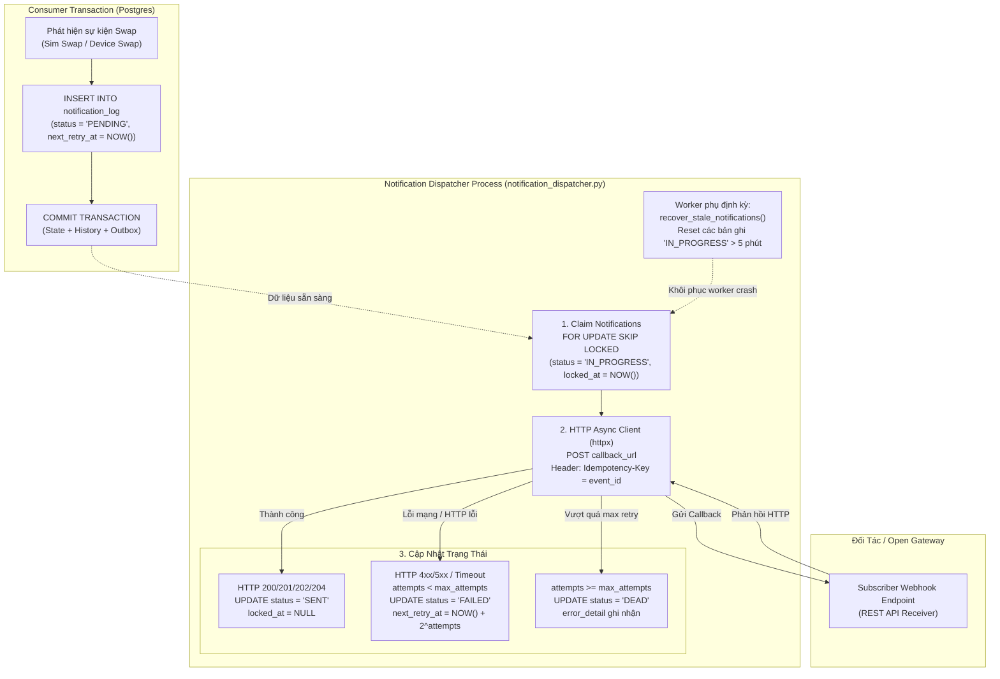
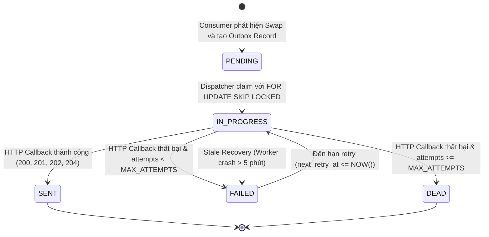

# `pipeline/dispatcher/` — Event Dispatcher (Stage 3)

Thư mục `pipeline/dispatcher/` chứa tiến trình worker độc lập thực hiện **Transactional Outbox Pattern** để phân phối các sự kiện thông báo (Webhooks Callback) tới các đối tác bên thứ ba (Open Gateway Subscribers) một cách bất đồng bộ, đáng tin cậy, và không làm ảnh hưởng đến throughput xử lý của luồng chính.

---

## 1. Kiến trúc Transactional Outbox Pattern & Luồng hoạt động



---

## 2. Vòng đời Trạng thái của Notification (State Machine)



---

## 3. Chi tiết kỹ thuật & Tính năng cốt lõi

1. **Khử Nghẽn Đường Xử Lý Chính (Decoupled Hot Path)**:
   - Các Consumer Kafka **không bao giờ thực hiện HTTP request**. Mọi thông báo chỉ được ghi vào bảng cơ sở dữ liệu `notification_log` trong cùng transaction với state thay đổi.
   - Nhờ đó, nếu subscriber chậm hoặc mất kết nối, consumer không bị block bởi
     HTTP. Throughput thực tế vẫn phụ thuộc profile Kafka/PG/Redis và chỉ được
     công nhận qua soak test; outbox không tự bảo đảm một con số pkt/s cụ thể.

2. **Cơ chế Khóa Tranh Chấp `FOR UPDATE SKIP LOCKED`**:
   - Khi chạy nhiều instance Dispatcher song song (Horizontal Scaling), câu lệnh SQL sử dụng `FOR UPDATE SKIP LOCKED` đảm bảo mỗi notification chỉ được nhận bởi đúng một worker mà không gây xung đột lock table hay deadlock giữa các tiến trình.

3. **Tính Bất Biến & Chống Trùng Lặp (Idempotency)**:
   - Mỗi HTTP POST callback được đính kèm header chuẩn `Idempotency-Key: <event_id>`.
   - Phía subscriber có thể dựa vào `event_id` này để loại bỏ các thông báo xử lý trùng lặp khi mạng có hiện tượng retry.

4. **Chiến Lược Retry với Exponential Backoff**:
   - Khi request thất bại, thời gian chờ retry được tính theo công thức lũy thừa:
     $$\text{delay} = \min(2^{\text{attempts}}, 300) \text{ giây}$$
   - Sau khi vượt quá `DISPATCHER_MAX_ATTEMPTS` (mặc định 5 lần), trạng thái được chuyển thành `DEAD` để phục vụ giám sát và can thiệp thủ công.

5. **Tự Động Khôi Phục Khi Worker Crash (Stale Claim Recovery)**:
   - Nếu tiến trình Dispatcher bị tắt đột ngột (SIGKILL / OOM) khi đang giữ các bản ghi ở trạng thái `IN_PROGRESS`, worker định kỳ (`recover_stale_notifications`) sẽ tự động quét và khôi phục các bản ghi bị khóa quá 5 phút về trạng thái `FAILED` để thử lại.

---

## 4. Cấu trúc Bảng Cơ Sở Dữ Liệu Liên Quan

### Bảng `notification_log`
```sql
CREATE TABLE notification_log (
    id SERIAL PRIMARY KEY,
    event_id VARCHAR(128) NOT NULL,
    subscription_id VARCHAR(64) NOT NULL REFERENCES subscription(subscription_id),
    event_type VARCHAR(32) NOT NULL,
    payload JSONB NOT NULL,
    status VARCHAR(16) NOT NULL DEFAULT 'PENDING',  -- PENDING, IN_PROGRESS, SENT, FAILED, DEAD
    attempts INT NOT NULL DEFAULT 0,
    created_at TIMESTAMPTZ NOT NULL DEFAULT NOW(),
    last_attempt_at TIMESTAMPTZ,
    next_retry_at TIMESTAMPTZ,
    locked_at TIMESTAMPTZ,
    error_detail TEXT,
    CONSTRAINT uq_notif_event_sub UNIQUE (event_id, subscription_id)
);
```

### Bảng `subscription`
```sql
CREATE TABLE subscription (
    subscription_id VARCHAR(64) PRIMARY KEY,
    msisdn VARCHAR(16),  -- NULL nghĩa là đăng ký nhận sự kiện cho toàn bộ thuê bao
    event_type VARCHAR(32) NOT NULL, -- 'SIM_SWAP' hoặc 'DEVICE_SWAP'
    callback_url VARCHAR(512) NOT NULL,
    status VARCHAR(16) NOT NULL DEFAULT 'ACTIVE',
    created_at TIMESTAMPTZ NOT NULL DEFAULT NOW(),
    expires_at TIMESTAMPTZ
);
```

---

## 5. Hướng dẫn vận hành & Biến môi trường

### 5.1. Khởi chạy tiến trình
```bash
python -m pipeline.dispatcher.notification_dispatcher
```

### 5.2. Các biến môi trường tùy chỉnh
| Biến Môi Trường | Mặc Định | Mô Tả |
|---|---|---|
| `DISPATCHER_BATCH_SIZE` | `50` | Số lượng notification tối đa được claim trong 1 chu kỳ poll |
| `DISPATCHER_POLL_INTERVAL` | `2.0` | Thời gian nghỉ giữa các lần poll khi không có dữ liệu (giây) |
| `DISPATCHER_MAX_ATTEMPTS` | `5` | Số lần thử lại tối đa trước khi đánh dấu là `DEAD` |
| `DATABASE_URL` | `postgresql://...` | Connection string tới PostgreSQL |
