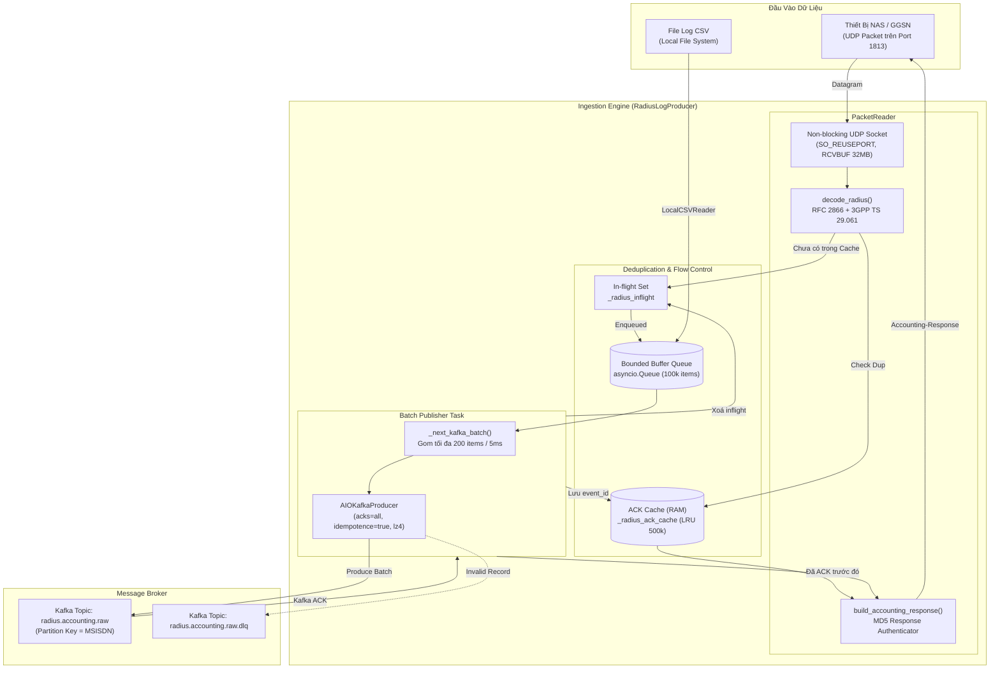

# `pipeline/ingestion/` — Ingestion Layer (Stage 1)

Thư mục `pipeline/ingestion/` chịu trách nhiệm tiếp nhận toàn bộ dữ liệu RADIUS Accounting thô từ các thiết bị mạng viễn thông (GGSN, PGW, NAS) qua giao thức UDP hoặc từ các file log batch định dạng CSV, thực hiện chuẩn hoá và đẩy vào Apache Kafka topic `radius.accounting.raw` với độ tin cậy cao (`acks=all`).

---

## 1. Kiến trúc Ingestion & Luồng dữ liệu chi tiết



---

## 2. Chi tiết các thành phần trong `ingestion/`

| File | Vai Trò & Chức Năng |
|---|---|
| [`packet_reader.py`](packet_reader.py) | **Bộ giải mã nhị phân RADIUS RFC 2866**: Mở UDP Socket (hỗ trợ `SO_REUSEPORT`), giải mã các thuộc tính chuẩn và thuộc tính 3GPP Vendor-Specific (IMSI, IMEI, RAT Type, MCC/MNC), xác thực MD5 Request Authenticator, và tạo gói tin `Accounting-Response` (Code=5). |
| [`producer.py`](producer.py) | **`RadiusLogProducer`**: Quản lý hàng đợi đệm bất đồng bộ (`asyncio.Queue`), gom micro-batching đẩy vào Kafka với `acks=all`, duy trì bộ nhớ cache deduplication để chỉ trả lời ACK RADIUS sau khi Kafka đã xác nhận ghi an toàn. |
| [`csv_reader.py`](csv_reader.py) | **`LocalCSVReader`**: Đọc stream từng dòng từ file CSV bằng generator, loại bỏ khoảng trắng thừa, tối ưu hoá việc sử dụng RAM khi nạp file log dung lượng lớn. |
| [`radius_udp_sender.py`](radius_udp_sender.py) | **RADIUS Traffic Generator (Test Tool)**: Giả lập lưu lượng từ thiết bị NAS/GGSN thật, đóng gói bản ghi CSV thành gói tin nhị phân RADIUS, gửi qua UDP kèm cơ chế pacing rate, theo dõi ACK và tự động retry khi timeout. |

---

## 3. Cấu trúc Gói tin RADIUS & Bảng mã thuộc tính (RFC 2866 & 3GPP VSA)

Hệ thống hỗ trợ giải mã đầy đủ các trường dữ liệu di động viễn thông theo chuẩn 3GPP:

```
 0                   1                   2                   3
 0 1 2 3 4 5 6 7 8 9 0 1 2 3 4 5 6 7 8 9 0 1 2 3 4 5 6 7 8 9 0 1
+-+-+-+-+-+-+-+-+-+-+-+-+-+-+-+-+-+-+-+-+-+-+-+-+-+-+-+-+-+-+-+-+
|     Code      |  Identifier   |            Length             |
+-+-+-+-+-+-+-+-+-+-+-+-+-+-+-+-+-+-+-+-+-+-+-+-+-+-+-+-+-+-+-+-+
|                                                               |
|                     Request Authenticator                     |
|                           (16 bytes)                          |
|                                                               |
+-+-+-+-+-+-+-+-+-+-+-+-+-+-+-+-+-+-+-+-+-+-+-+-+-+-+-+-+-+-+-+-+
|  Attributes ... (Standard AVPs & 3GPP Vendor-Specific AVPs)
```

### Bảng thuộc tính chuẩn & 3GPP VSA (Vendor ID = 10415 / 0x28AF):

| Thuộc tính (AVP) | Type Hex (Dec) | Kiểu Dữ Liệu | Ý Nghĩa / Ánh Xạ Nghiệp Vụ |
|---|---|---|---|
| `Acct-Status-Type` | `0x28` (40) | Integer (4 bytes) | 1=Start, 2=Stop, 3=Interim-Update, 7=Accounting-On, 8=Accounting-Off |
| `Calling-Station-Id` | `0x1f` (31) | String | Số thuê bao di động (`msisdn`, chuẩn hoá E.164) |
| `Framed-IP-Address` | `0x08` (8) | IPv4 (4 bytes) | Địa chỉ IP cấp cho thiết bị di động (`framed_ip`) |
| `Acct-Session-Id` | `0x2c` (44) | String | Mã định danh phiên mạng của GGSN (`acct_session_id`) |
| `Acct-Session-Time` | `0x2d` (45) | Integer | Thời lượng phiên tính bằng giây (`acct_session_time`) |
| `Event-Timestamp` | `0x37` (55) | Date/Epoch | Thời điểm sự kiện diễn ra tại thiết bị trạm |
| `NAS-IP-Address` | `0x04` (4) | IPv4 | Địa chỉ IP của thiết bị NAS/GGSN |
| `NAS-Identifier` | `0x20` (32) | String | Tên định danh trạm NAS/GGSN (`nas_identifier`) |
| **Vendor-Specific** | `0x1a` (26) | VSA | 3GPP Specific Attributes: |
| ↳ `3GPP-IMSI` | Subtype `0x01` | String | Mã nhận dạng thuê bao di động quốc tế (`imsi`) |
| ↳ `3GPP-IMEISV` | Subtype `0x14` (20) | String | Mã định danh thiết bị phần cứng di động (`imei`) |
| ↳ `3GPP-RAT-Type` | Subtype `0x15` (21) | String | Loại sóng mạng: 1=UTRAN, 2=GERAN, 6=EUTRAN (LTE) |
| ↳ `3GPP-SGSN-MCC-MNC` | Subtype `0x08` (8) | String | Mã mạng quốc gia và nhà mạng viễn thông |

---

## 4. Cơ chế Backpressure & Xử lý trùng lặp (Deduplication)

1. **Nguyên lý Xác thực Response**:
   - `PacketReader` **chỉ** gửi `Accounting-Response` (Code=5) sau khi gói tin đã được ghi nhận an toàn vào Kafka Broker (`acks=all`).
   - Nếu Kafka bị nghẽn hoặc Bounded RAM Queue đầy (`100,000` records), gói tin mới sẽ bị tạm giữ (withheld ACK) hoặc drop tạm thời (`queue_rejected_for_retry`), kích hoạt cơ chế retry tự nhiên của thiết bị NAS qua UDP.

2. **Deduplication Cache**:
   - Khi NAS gửi retry cho một gói tin mà Kafka đã xử lý xong trước đó, `_is_radius_duplicate()` kiểm tra trong `_radius_ack_cache` (bộ nhớ LRU 500.000 phần tử, TTL 120s).
   - Nếu phát hiện trùng lặp, hệ thống **trả ngay Accounting-Response** mà không đẩy lại vào Kafka, ngăn ngừa duplicate message gây lãng phí tài nguyên của các consumer phía sau.

---

## 5. Hướng dẫn sử dụng & Tham số cấu hình

### 5.1. Khởi chạy UDP Receiver (Lắng nghe cổng 1813)
```bash
python -m pipeline.ingestion.producer --udp --port 1813
```

### 5.2. Nạp trực tiếp từ file CSV
```bash
python -m pipeline.ingestion.producer --file data/radius_sample.csv
```

### 5.3. Chạy Traffic Generator giả lập lưu lượng
```bash
# Bắn 5.000 gói/giây từ CSV, lặp lại vô hạn, bật kiểm tra ACK
python -m pipeline.ingestion.radius_udp_sender \
    --csv data/radius_sample.csv \
    --host 127.0.0.1 \
    --port 1813 \
    --rate 5000 \
    --require-ack \
    --loop
```

### 5.4. Các biến môi trường tùy chỉnh
| Biến Môi Trường | Mặc Định | Mô Tả |
|---|---|---|
| `RADIUS_SHARED_SECRET` | `camara-radius-dev-secret` | Shared secret dùng để tính MD5 Authenticator |
| `RADIUS_UDP_RECEIVE_BUFFER_BYTES` | `33554432` (32MB) | Kích thước socket receive buffer của OS |
| `RADIUS_UDP_QUEUE_MAX_RECORDS` | `100000` | Dung lượng hàng đợi RAM đệm trước Kafka (khuyên dùng `300000` cho Prod) |
| `RADIUS_UDP_KAFKA_BATCH_RECORDS` | `250` | Số lượng bản ghi gom cho mỗi batch Kafka |
| `RADIUS_UDP_KAFKA_BATCH_WAIT_MS` | `5` | Thời gian chờ tối đa gom batch (ms) |
| `RADIUS_UDP_KAFKA_MAX_INFLIGHT_BATCHES_PER_WORKER` | `32` | Số lượng batch Kafka produce song song cho mỗi worker |
| `RADIUS_UDP_KAFKA_TOTAL_MAX_INFLIGHT_BATCHES` | `64` | Giới hạn tổng số batch Kafka produce song song trên toàn bộ process |
| `RADIUS_UDP_PUBLISHER_WORKERS` | `4` | Số lượng worker coroutines publish song song (Key-sharded per MSISDN) |
| `RADIUS_ACK_CACHE_MAX_RECORDS` | `500000` | Số lượng event ID lưu trong cache deduplication |
| `RADIUS_ACK_CACHE_TTL_SECONDS` | `120` | Thời gian sống (TTL) của cache deduplication |
| `INGESTION_METRICS_PORT` | `9201` | Cổng HTTP Exporter cho Prometheus Ingestion Metrics (tự động thử 9201-9210 nếu bận) |
| `INGESTION_COMPRESSION_TYPE` | `lz4` | Chuẩn nén dữ liệu đẩy vào Kafka (`lz4`, `gzip`, `snappy`) |

### 5.5. Tính Toán Dung Lượng & Cấu Hình NAS Retry Sizing
- **Tổng dung lượng Inflight Kafka**:
  $$\text{Total Inflight Capacity} = \text{Total Batches (64)} \times \text{Batch Size (250)} = \mathbf{16.000 \text{ records}}$$
- **Thời gian Hấp thụ Tràn Hàng Đợi RAM (Burst Absorption Window)**:
  $$\text{Hold Time (100k queue)} = \frac{100.000 \text{ records}}{15.000 \text{ pkt/s}} \approx \mathbf{6,7 \text{ giây}}$$
  *(Trên Production khuyên dùng `RADIUS_UDP_QUEUE_MAX_RECORDS=300000` để hấp thụ burst 20 giây khi Kafka failover).*
- **Quy chuẩn Cấu hình Retry phía Thiết bị Mạng (GGSN / NAS)**:
  Cấu hình thiết bị GGSN/NAS với `timeout=2s, retries=5` ($\text{tổng cửa sổ retry} = 10 \text{ giây}$) để khớp với thời gian rebalance/failover của Kafka Cluster.

### 5.6. Load-Test Đa Socket Qua Kernel `SO_REUSEPORT` & Multiplex ACK Receiver
- **Đa Source Port**: Khi load-test với nhiều container `radius-ingestion` trên Linux, Kernel phân bổ gói tin dựa trên hash 4-tuple (`source_ip, source_port, dest_ip, dest_port`). Dùng cờ `--num-sockets 8` trên `radius-udp-sender` để phát từ 8 client source ports khác nhau, đảm bảo lưu lượng được chia đều 100% qua các container Ingestion.
- **Multiplex ACK Receiver**: Thread `receive_responses()` trong `radius_udp_sender.py` sử dụng `select.select(sockets, [], [], 0.02)` để lắng nghe đồng thời response trên tất cả $N$ sockets, khớp chính xác socket nguồn gốc khi retry mà không bị nghẽn timeout giả.

---

## 6. Log Telemetry & Giám sát Metrics Chuyên Biệt (Split Metrics Semantics)

Log định kỳ mỗi 10 giây in định dạng cấu trúc chi tiết:

```
[INGESTION][OK] window=10.0s | Throughput: udp_in=9835.0/s kafka_ack=9189.6/s | Queue/Inflight: queue=0/100000(0.0%) inflight_radius=0 | RADIUS Responses: total=155970 (new_ack=110520, dup_ack=45450, withheld=0, failed=0) | Kafka Batch: 250rec/27.9ms (1075.0/s) | Quality/Loss: data_loss=0(+0) (rejected=0, dlq=0, pub_failed=0, queue_drop=0) | Totals: received=155970, kafka_acked=110520
```

### Metrics Prometheus Exporter (`http://<host>:9201/metrics`)

| Prometheus Metric Name | Type | Description |
|---|---|---|
| `radius_ingestion_udp_received_total` | Counter | Tổng số gói UDP nhận từ mạng |
| `radius_ingestion_kafka_acked_total` | Counter | Tổng số bản ghi Kafka đã xác nhận an toàn (`acks=all`) |
| `radius_ingestion_duplicate_acked_total` | Counter | Số bản ghi trùng lặp được trả ACK ngay từ RAM Cache |
| `radius_ingestion_queue_depth_records` | Gauge | Tổng số bản ghi đang chờ trong RAM queues |
| `radius_ingestion_worker_queue_depth_records{worker="N"}` | Gauge | Số bản ghi đang chờ trong queue của worker shard `N` |
| `radius_ingestion_invalid_total` | Counter | Số bản ghi sai cấu trúc dữ liệu bị đẩy vào DLQ |
| `radius_ingestion_dlq_published_total` | Counter | Số bản ghi DLQ đã ghi thành công vào Kafka `.dlq` topic |
| `radius_ingestion_publish_failed_total` | Counter | Lỗi tạm thời khi produce Kafka (NAS chưa nhận ACK và sẽ retry) |
| `radius_ingestion_queue_rejected_for_retry_total` | Counter | Số bản ghi bị từ chối do RAM Queue đầy (NAS không nhận ACK và sẽ retry) |

> 📖 **Báo cáo Kỹ thuật Chuyên sâu**: Đọc phân tích chi tiết kỹ thuật RFC 2866, MD5 Authenticator, `SO_REUSEPORT`, Key-sharded Publisher và E2E Epoch Lag tại [`docs/BAO_CAO_KY_THUAT_PIPELINE.md`](../../docs/BAO_CAO_KY_THUAT_PIPELINE.md).
