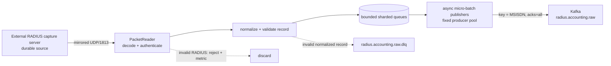

# `pipeline/ingestion/` — passive RADIUS mirror ingestion

Khối này nhận bản sao RADIUS Accounting từ capture server qua UDP/1813, giải mã,
chuẩn hóa và ghi vào Kafka topic `radius.accounting.raw`. Capture server nằm ngoài
phạm vi repo và chịu trách nhiệm thu nhận bền vững cũng như giao thức với thiết bị
mạng.

Ingestion trong repo **không** gửi `Accounting-Response`, không chờ RADIUS ACK,
không retry datagram và không duy trì ACK/dedup cache. Kafka `acks=all` chỉ là cơ
chế bền vững nội bộ giữa producer và Kafka, không phải phản hồi RADIUS.

## Luồng dữ liệu



Khi RAM queue đầy hoặc Kafka publish thất bại, bản mirror tương ứng được tính vào
`data_loss`. Repo không thể yêu cầu nguồn gửi lại; hệ thống vận hành phải cảnh báo
và replay từ capture server bền vững nếu cần.

## Thành phần

| File | Trách nhiệm |
|---|---|
| `packet_reader.py` | Mở UDP socket, kiểm tra Accounting-Request, xác thực Request Authenticator, giải mã AVP chuẩn và 3GPP VSA. |
| `producer.py` | Chuẩn hóa record, phân shard theo MSISDN, ánh xạ worker vào Kafka producer pool, gom batch bất đồng bộ và ghi Kafka/DLQ. |
| `csv_reader.py` | Đọc CSV dạng streaming cho đường ingest trực tiếp. |
| `radius_udp_sender.py` | Công cụ load-test fire-and-forget: mã hóa CSV thành RADIUS và phát UDP theo rate; không mô phỏng ACK/retry. |

## Chạy

```bash
# Listener passive mirror
python -m pipeline.ingestion.producer --udp --port 1813

# Ingest CSV trực tiếp vào Kafka
python -m pipeline.ingestion.producer --file data/radius_log.csv

# Load-test đường UDP, không chờ response
python -m pipeline.ingestion.radius_udp_sender \
  --csv data/radius_log.csv --host 127.0.0.1 --port 1813 --rate 15000
```

## Cấu hình chính

| Biến | Mặc định | Ý nghĩa |
|---|---:|---|
| `RADIUS_SHARED_SECRET` | bắt buộc | Xác thực Request Authenticator của gói mirror. |
| `RADIUS_UDP_RECEIVE_BUFFER_BYTES` | `33554432` | Socket receive buffer yêu cầu từ OS. |
| `RADIUS_UDP_QUEUE_MAX_RECORDS` | `300000` | Tổng burst buffer RAM; không phải durable queue. |
| `RADIUS_UDP_PUBLISHER_WORKERS` | `4` | Số queue/publisher shard theo MSISDN. |
| `RADIUS_UDP_KAFKA_PRODUCERS` | `4` | Số producer độc lập; một worker luôn dùng cùng producer. |
| `RADIUS_UDP_KAFKA_BATCH_RECORDS` | `500` | Số record tối đa mỗi micro-batch. |
| `RADIUS_UDP_KAFKA_BATCH_WAIT_MS` | `5` | Thời gian gom batch tối đa. |
| `RADIUS_UDP_KAFKA_MAX_INFLIGHT_BATCHES_PER_WORKER` | `4` | Giới hạn batch đang ghi cho mỗi worker. |
| `RADIUS_UDP_KAFKA_PRESSURE_INFLIGHT_BATCHES_PER_WORKER` | `6` | Giới hạn mỗi worker khi queue shard đạt 50%. |
| `RADIUS_UDP_KAFKA_PRESSURE_QUEUE_RATIO` | `0.5` | Ngưỡng kích hoạt pressure concurrency. |
| `RADIUS_UDP_KAFKA_TOTAL_MAX_INFLIGHT_BATCHES` | `24` | Trần tuyệt đối toàn process. |
| `INGESTION_BATCH_SIZE_BYTES` | `524288` | Batch buffer tối đa của Kafka producer. |
| `INGESTION_KAFKA_PERSIST_WARN_MS` | `500` | Ngưỡng cảnh báo p95 thời gian ghi Kafka. |
| `INGESTION_QUEUE_WARN_MS` | `1000` | Ngưỡng cảnh báo p95 thời gian nằm trong queue. |

## Telemetry

```text
[INGESTION][OK] window=10.0s | Throughput: udp_in=15000.0/s kafka_persisted=15100.0/s gap=-100.0/s | Queue: depth=0/300000(0.0%) backlog=0.00s | Kafka: batch_avg=420.0rec last=500rec/24.0ms persist(p50=18.0ms p95=35.0ms p99=48.0ms) queue_p95=12.0ms worker_slot_wait_p95=0.0ms global_wait_p95=0.0ms | Quality/Loss: data_loss=0(+0) (queue_dropped=0, pub_failed=0, dlq=0, invalid=0) | Totals: received=150000, kafka_persisted=150000
```

| Metric | Ý nghĩa |
|---|---|
| `radius_ingestion_udp_received_total` | Datagram đã nhận ở application socket. |
| `radius_ingestion_kafka_persisted_total` | Record đã được Kafka xác nhận theo cấu hình producer. |
| `radius_ingestion_queue_capacity_records` | Tổng dung lượng queue cấu hình, dùng tính pressure ratio. |
| `radius_ingestion_queue_dropped_total` | Record mirror bị bỏ vì queue đầy. |
| `radius_ingestion_publish_failed_total` | Record không ghi được Kafka. |
| `radius_ingestion_kafka_batch_persist_seconds` | Phân bố latency ghi batch Kafka. |
| `radius_ingestion_queue_residence_seconds` | Thời gian record chờ trong RAM queue. |
| `radius_ingestion_worker_slot_wait_seconds{worker}` | Thời gian publisher chờ slot inflight của chính worker. |

Điều kiện vận hành bình thường là `udp_in` xấp xỉ `kafka_persisted`, queue không
tăng liên tục và `data_loss=0`. Queue chỉ hấp thụ burst ngắn; nó không thay thế
durable buffering tại capture server hoặc Kafka.
