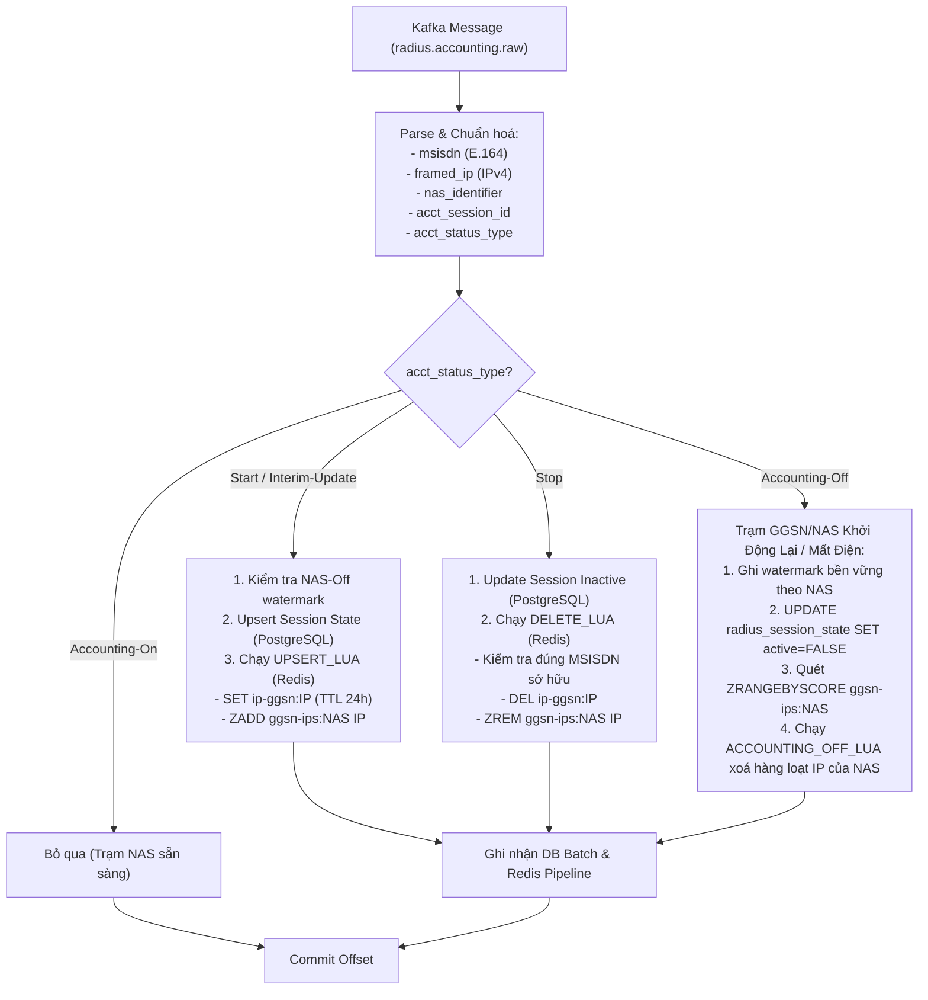

# `pipeline/modules/ip_msisdn/` — Module 1: Ánh Xạ IP ↔ MSISDN

Consumer Group: `cg-ip-msisdn`. Module này chịu trách nhiệm duy trì ánh xạ thời gian thực giữa **Địa chỉ IP mạng (Framed-IP-Address)** và **Số điện thoại thuê bao (MSISDN)** theo phiên dữ liệu di động, phục vụ trực tiếp cho chuẩn API **CAMARA Number Verification** (Xác thực số điện thoại tự động qua kết nối mạng di động mà không cần OTP SMS).

---

## 1. Luồng xử lý sự kiện & Vòng đời phiên (Flow Diagram)



---

## 2. Cấu trúc lưu trữ dữ liệu kép (PostgreSQL & Redis)

Module quản lý trạng thái phiên trên cả hai hệ thống lưu trữ:

### 2.1. Redis (Read Cache phục vụ CAMARA API)
1. **`ip-ggsn:<framed_ip>`** (Key-Value String, TTL 86400s / 24h):
   - Lưu trữ JSON thông tin phiên hiện tại:
     ```json
     {
       "msisdn": "+84981234567",
       "nas_identifier": "GGSN-HN-01",
       "event_timestamp": "2026-08-27T08:30:00+00:00",
       "event_epoch": 1787819400.0,
       "event_id": "radius:a1b2c3d4...",
       "source_partition": 2,
       "source_offset": 105432
     }
     ```
2. **`ggsn-ips:<nas_identifier>`** (Sorted Set):
   - Member: `framed_ip`
   - Score: `event_epoch`
   - Mục đích: Đóng vai trò Reverse Index giúp thu hồi và xoá hàng loạt tất cả địa chỉ IP của một trạm NAS khi xảy ra sự kiện `Accounting-Off`.
3. **`nas-off-watermark:<nas_identifier>`**:
   - Lưu timestamp `Accounting-Off` lớn nhất. Lua từ chối `Start/Interim` cũ hơn hoặc bằng watermark, kể cả khi chúng đến từ Kafka partition khác.

### 2.2. PostgreSQL (Persistent Session History & Audit)
Bảng `radius_session_state` lưu trữ trạng thái phiên bền vững:
```sql
CREATE TABLE radius_session_state (
    acct_session_id VARCHAR(128) PRIMARY KEY, -- NAS:session_id
    msisdn VARCHAR(16) NOT NULL,
    nas_identifier VARCHAR(64),
    active BOOLEAN NOT NULL DEFAULT TRUE,
    last_event_at TIMESTAMPTZ NOT NULL,
    last_event_id VARCHAR(128) NOT NULL,
    source_partition INT NOT NULL,
    source_offset BIGINT NOT NULL,
    updated_at TIMESTAMPTZ NOT NULL DEFAULT NOW()
);
```

Bảng `radius_nas_off_watermark` giữ fence bền vững theo NAS. Upsert session dùng một CTE duy nhất để lấy row lock `FOR SHARE`, lọc watermark và UPSERT trong cùng round-trip; Accounting-Off cập nhật row bằng lock độc quyền. Một Start cũ không thể lọt race, trong khi các batch session thường vẫn song song.

---

## 3. Các Lua Scripts đảm bảo tính nguyên tử (Atomicity & Fencing)

Để chống race condition khi các gói tin mạng đến sai thứ tự (ví dụ gói `Stop` đến trước gói `Interim-Update`), module sử dụng các script Lua thực thi nguyên tử trên Redis:

### 3.1. `UPSERT_LUA`
- Kiểm tra phiên bản của bản ghi cũ trong Redis:
  $$\text{Chấp nhận nếu: } \text{epoch}_{\text{mới}} > \text{epoch}_{\text{cũ}} \lor (\text{epoch bằng nhau} \land \text{offset}_{\text{mới}} > \text{offset}_{\text{cũ}})$$
- Nếu IP trước đó thuộc NAS khác, tự động xóa IP khỏi `ggsn-ips:<nas_cu>`.
- Ghi đè key `ip-ggsn:<ip>` với TTL mới và cập nhật `ggsn-ips:<nas_moi>`.

### 3.2. `DELETE_LUA`
- **Ownership Check**: Đọc giá trị hiện tại của `ip-ggsn:<ip>`, chỉ cho phép xóa nếu `msisdn` trong Redis **trùng khớp hoàn toàn** với `msisdn` trong sự kiện `Stop`.
- Điều này ngăn chặn việc gói tin `Stop` bị trễ vô tình xóa mất phiên mới của thuê bao khác đã được cấp lại cùng địa chỉ IP đó.

### 3.3. `ACCOUNTING_OFF_LUA`
- Đọc danh sách IP từ Sorted Set của NAS, xóa các key `ip-ggsn:<ip>` có thời gian sự kiện nhỏ hơn hoặc bằng thời điểm xảy ra `Accounting-Off`.
- Watermark được cập nhật nguyên tử trước khi quét. Upsert xảy ra trước sẽ bị vòng quét xóa; upsert xảy ra sau sẽ bị watermark từ chối.

---

## 4. Cơ chế Batching trong `process_batch()`

1. **Khử trùng lặp nội bộ Batch (Deduplication per Batch)**:
   - Nếu cùng một `acct_session_id` xuất hiện nhiều lần trong 1 batch (ví dụ `Start` rồi `Interim-Update`), chỉ bản ghi có offset mới nhất được đưa vào danh sách Upsert PostgreSQL nhằm tránh lỗi `CardinalityViolationError` trong câu lệnh SQL.
2. **Hai nhánh persistence song song**:
   - Nhánh PostgreSQL dùng `db.persist_session_batch()` ghi toàn bộ session trong một round-trip và xử lý `Accounting-Off` theo thứ tự.
   - Nhánh Redis dùng `store.apply_batch()` đưa các lệnh Lua vào pipeline `transaction=False`; các đoạn được ngắt tại `Accounting-Off` để giữ đúng thứ tự offset.
   - `asyncio.gather(..., return_exceptions=True)` luôn đợi cả hai nhánh kết thúc. Kafka chỉ commit offset khi cả PostgreSQL và Redis đều thành công; retry an toàn nhờ version fence/idempotency ở cả hai store.
3. **Mục tiêu latency**:
   - Critical path đổi từ gần `postgres + redis` thành gần `max(postgres, redis)`.
   - Telemetry `persist_parallel` đo trực tiếp thời gian chờ chung của hai nhánh để phân biệt với latency riêng `pg` và `rds`.

Ngoài song song PostgreSQL/Redis, lớp consumer dùng một FIFO và một mutating worker cho mỗi Kafka partition. Các partition chạy song song, nhưng một partition không bao giờ có hai batch thay đổi state cùng lúc. Batch thành công công bố offset cho coordinator; coordinator coalesce commit theo thời gian/số record ngoài critical path, loại bỏ barrier và Kafka RTT trên từng micro-batch.
