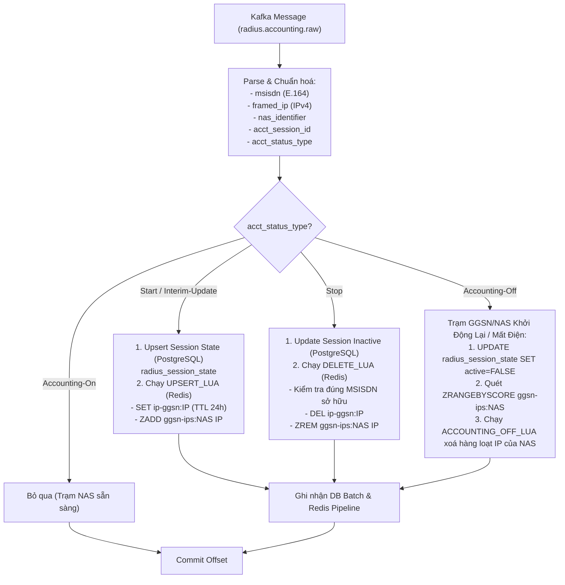

# `pipeline/modules/ip_msisdn/` — Module 1: Ánh Xạ IP ↔ MSISDN

Consumer Group: `cg-ip-msisdn`. Module này chịu trách nhiệm duy trì ánh xạ thời gian thực giữa **Địa chỉ IP mạng (Framed-IP-Address)** và **Số điện thoại thuê bao (MSISDN)** theo phiên dữ liệu di động, phục vụ trực tiếp cho chuẩn API **CAMARA Number Verification** (Xác thực số điện thoại tự động qua kết nối mạng di động mà không cần OTP SMS).

---

## 1. Luồng xử lý sự kiện & Vòng đời phiên (Flow Diagram)



---

## 2. Cấu trúc lưu trữ dữ liệu kép (PostgreSQL & Redis)

Module quản lý trạng thái phiên trên cả hai hệ thống lưu trữ:

### 2.1. Redis (Read Cache phục vụ CAMARA API)
1. **`ip-ggsn:<framed_ip>`** (Key-Value String, TTL 86400s / 24h):
   - Lưu trữ JSON thông tin phiên hiện tại:
     ```json
     {
       "msisdn": "+84981234567",
       "nas_identifier": "GGSN-HN-01",
       "event_timestamp": "2026-08-27T08:30:00+00:00",
       "event_epoch": 1787819400.0,
       "event_id": "radius:a1b2c3d4...",
       "source_partition": 2,
       "source_offset": 105432
     }
     ```
2. **`ggsn-ips:<nas_identifier>`** (Sorted Set):
   - Member: `framed_ip`
   - Score: `event_epoch`
   - Mục đích: Đóng vai trò Reverse Index giúp thu hồi và xoá hàng loạt tất cả địa chỉ IP của một trạm NAS khi xảy ra sự kiện `Accounting-Off`.

### 2.2. PostgreSQL (Persistent Session History & Audit)
Bảng `radius_session_state` lưu trữ trạng thái phiên bền vững:
```sql
CREATE TABLE radius_session_state (
    acct_session_id VARCHAR(128) PRIMARY KEY, -- NAS:session_id
    msisdn VARCHAR(16) NOT NULL,
    nas_identifier VARCHAR(64),
    active BOOLEAN NOT NULL DEFAULT TRUE,
    last_event_at TIMESTAMPTZ NOT NULL,
    last_event_id VARCHAR(128) NOT NULL,
    source_partition INT NOT NULL,
    source_offset BIGINT NOT NULL,
    updated_at TIMESTAMPTZ NOT NULL DEFAULT NOW()
);
```

---

## 3. Các Lua Scripts đảm bảo tính nguyên tử (Atomicity & Fencing)

Để chống race condition khi các gói tin mạng đến sai thứ tự (ví dụ gói `Stop` đến trước gói `Interim-Update`), module sử dụng các script Lua thực thi nguyên tử trên Redis:

### 3.1. `UPSERT_LUA`
- Kiểm tra phiên bản của bản ghi cũ trong Redis:
  $$\text{Chấp nhận nếu: } \text{epoch}_{\text{mới}} > \text{epoch}_{\text{cũ}} \lor (\text{epoch bằng nhau} \land \text{offset}_{\text{mới}} > \text{offset}_{\text{cũ}})$$
- Nếu IP trước đó thuộc NAS khác, tự động xóa IP khỏi `ggsn-ips:<nas_cu>`.
- Ghi đè key `ip-ggsn:<ip>` với TTL mới và cập nhật `ggsn-ips:<nas_moi>`.

### 3.2. `DELETE_LUA`
- **Ownership Check**: Đọc giá trị hiện tại của `ip-ggsn:<ip>`, chỉ cho phép xóa nếu `msisdn` trong Redis **trùng khớp hoàn toàn** với `msisdn` trong sự kiện `Stop`.
- Điều này ngăn chặn việc gói tin `Stop` bị trễ vô tình xóa mất phiên mới của thuê bao khác đã được cấp lại cùng địa chỉ IP đó.

### 3.3. `ACCOUNTING_OFF_LUA`
- Đọc danh sách IP từ Sorted Set của NAS, xóa các key `ip-ggsn:<ip>` có thời gian sự kiện nhỏ hơn hoặc bằng thời điểm xảy ra `Accounting-Off`.

---

## 4. Cơ chế Batching trong `process_batch()`

1. **Khử trùng lặp nội bộ Batch (Deduplication per Batch)**:
   - Nếu cùng một `acct_session_id` xuất hiện nhiều lần trong 1 batch (ví dụ `Start` rồi `Interim-Update`), chỉ bản ghi có offset mới nhất được đưa vào danh sách Upsert PostgreSQL nhằm tránh lỗi `CardinalityViolationError` trong câu lệnh SQL.
2. **PostgreSQL Batch Upsert**:
   - Sử dụng `db.persist_session_batch()` ghi toàn bộ session trong batch chỉ qua **1 round-trip duy nhất**.
3. **Redis Pipeline Execution**:
   - `store.apply_batch()` đưa tất cả các lệnh Lua vào 1 Redis Pipeline (`transaction=False`), giảm thiểu network round-trip overhead xuống Redis.
