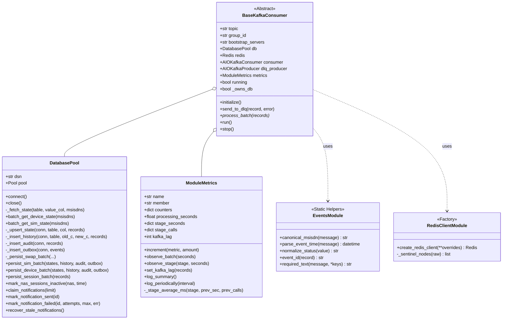

# `pipeline/modules/shared/` — Hạ Tầng Dùng Chung (Shared Infrastructure)

Thư mục `pipeline/modules/shared/` cung cấp các lớp trừu tượng nền tảng, hệ thống kết nối cơ sở dữ liệu, quản lý phiên bản tin cậy, chuẩn hoá dữ liệu viễn thông và hệ thống telemetry giám sát hiệu năng cho toàn bộ các Consumer Modules.

---

## 1. Sơ đồ quan hệ lớp chi tiết (Class Diagram)

---

## 2. Chi tiết các thành phần trong `shared/`

### 2.1. `BaseKafkaConsumer` (`base_consumer.py`)
Lớp cơ sở trừu tượng cho tất cả các consumer trong hệ thống:
- **Vòng lặp tiêu thụ (`run()`)**: Sử dụng `AIOKafkaConsumer.getmany()` gom tối đa `BATCH_MAX_RECORDS` hoặc chờ `BATCH_TIMEOUT_MS`.
- **Partition Concurrency & Sharding**: Phân chia các partitions nhận được thành `PROCESSING_PARTITION_CONCURRENCY` shards chạy song song (`asyncio.gather`), đảm bảo thứ tự offset trong từng partition luôn tuần tự.
- **Manual Offset Commit**: Chỉ commit offset sau khi xử lý thành công batch hoặc sau khi đẩy dữ liệu lỗi vào DLQ (`enable_auto_commit=False`).
- **Dead Letter Queue (DLQ)**: Khi một record hoặc batch bị lỗi cấu trúc dữ liệu nghiêm trọng vượt quá `MAX_BATCH_RETRIES` (mặc định 3 lần), toàn bộ thông tin nguồn (topic, partition, offset, error_type, payload) được đẩy vào `<topic>.dlq`.

### 2.2. `DatabasePool` (`db.py`)
Lớp bọc `asyncpg.Pool` tối ưu hoá hiệu năng cho PostgreSQL:
- **Single Connection Pool**: Quản lý connection pool duy nhất dùng chung cho toàn bộ các worker trong tiến trình, cấu hình qua `DB_POOL_MIN` và `DB_POOL_MAX`.
- **Giao dịch Nguyên Tử 4 Bảng (`_persist_swap_batch`)**:
  Thực thi trong cùng 1 `connection.transaction()`:
  1. `_upsert_state`: Upsert bảng state hiện tại (`msisdn_sim` hoặc `msisdn_device`) qua mệnh đề `UNNEST` kết hợp điều kiện so sánh phiên bản `(last_event_at, last_source_partition, last_source_offset)`.
  2. `_insert_history`: Ghi nhật ký lịch sử đổi SIM/thiết bị (`sim_swap_history`, `device_swap_history`).
  3. `_insert_audit`: Ghi vết kiểm toán hệ thống (`audit_log`).
  4. `_insert_outbox`: Ghi thông báo chờ gửi (`notification_log`) cho các subscription đang hoạt động.
- **Session State Tracking (`persist_session_batch`)**: Cập nhật trạng thái phiên RADIUS Accounting vào bảng `radius_session_state` với cơ chế chống ghi đè phiên bản cũ.

### 2.3. `ModuleMetrics` (`metrics.py`)
Hệ thống thu thập và xuất dữ liệu đo lường (Telemetry):
- **Prometheus Exporter**: Tự động đăng ký các metrics chuẩn:
  - `pipeline_batch_processed_total` (Counter)
  - `pipeline_events_detected_total` (Counter)
  - `pipeline_batch_errors_total` (Counter)
  - `pipeline_batch_latency_seconds` (Histogram)
  - `pipeline_stage_latency_seconds` (Histogram theo stage: state, postgres, redis)
  - `pipeline_kafka_lag_records` (Gauge theo từng member)
  - `pipeline_e2e_message_lag_seconds` (Histogram đo độ trễ từ lúc gói tin vào Ingestion đến khi hoàn tất ghi DB/Redis)
- **Sliding-Window Structured Logger**: Định kỳ in ra log phân khối trực quan (`|`), theo dõi riêng biệt:
  - Throughput (`recv`, `success`, `pg`, `rds`)
  - Latency (`batch_avg`, `stage(state, pg, rds)`, `e2e_lag(max)`)
  - Sự kiện Swap (`events_detected(+delta)`, `ignored`)
  - **Giám sát thất thoát (`data_loss = errors + dlq`)**
  - Số liệu tích lũy (`Totals`).

### 2.4. `redis_client.py`
Khởi tạo kết nối Redis hỗ trợ 2 chế độ:
- **Chế độ Standalone (Môi trường Dev)**: Kết nối trực tiếp qua `REDIS_HOST` và `REDIS_PORT`.
- **Chế độ Sentinel HA (Môi trường Production)**: Tự động khám phá Master Node thông qua danh sách Sentinel Nodes (`REDIS_SENTINELS`), hỗ trợ tự động failover mà không làm gián đoạn pipeline.

### 2.5. `events.py`
Bộ công cụ chuẩn hoá và kiểm tra ràng buộc dữ liệu:
- `canonical_msisdn()`: Chuẩn hoá số thuê bao theo định dạng quốc tế E.164 (bắt đầu bằng dấu `+`, từ 8 đến 15 chữ số).
- `parse_event_time()`: Phân giải timestamp từ chuỗi ISO-8601 hoặc Unix epoch thành đối tượng `datetime` có múi giờ chuẩn UTC.
- `normalize_status()`: Chuẩn hoá các trạng thái phiên RADIUS (`start`, `stop`, `interim-update`, `accounting-on`, `accounting-off`).
- `event_id()`: Tạo khóa định danh duy nhất cho sự kiện để đảm bảo tính Idempotency.

> 📖 **Báo cáo Kỹ thuật Chuyên sâu**: Đọc tài liệu phân tích kiến trúc chi tiết tại [`docs/BAO_CAO_KY_THUAT_PIPELINE.md`](../../docs/BAO_CAO_KY_THUAT_PIPELINE.md).

---

## 3. Ràng buộc toàn vẹn & Fencing Versioning

Để đảm bảo dữ liệu không bị sai lệch khi các sự kiện mạng đến sai thứ tự (Out-of-Order Delivery), hệ thống áp dụng cơ chế Fencing Tuple 3 thành phần:

$$\text{Version} = (\text{event\_timestamp}, \text{source\_partition}, \text{source\_offset})$$

Một bản ghi mới chỉ được phép cập nhật trạng thái nếu:

$$(\text{incoming.event\_timestamp}, \text{incoming.partition}, \text{incoming.offset}) > (\text{current.last\_event\_at}, \text{current.partition}, \text{current.offset})$$
